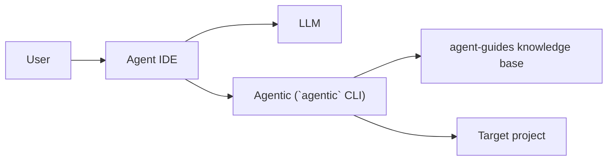

# agent-guides


**agentic = Agent Intelligence Configuration.**

A unified catalog of Agentic specializations and the `agentic` CLI. The repository provides orchestrator-ready rules,
skills, workflows, and prompts that can be installed into a target project from either a local checkout or an installed
binary in `~/.local/bin`.

- [coverage score card](https://claude.ai/public/artifacts/8177bc3d-3b2f-48a6-8232-47c5b02b20f3)
- [website](https://sawrus.github.io/agent-guides/)

---

## Repository structure

```text
agent-guides/
├── areas/
│   ├── software/
│   │   ├── general/          # Cross-cutting rules and workflows (always useful to include)
│   │   ├── backend/          # Backend service development
│   │   ├── frontend/         # Frontend/UI development
│   │   ├── full-stack/       # Full-stack with layered architecture focus
│   │   ├── data-engineering/ # dbt, warehouses, pipelines
│   │   ├── mlops/            # Model training, evaluation, deployment
│   │   ├── mobile/           # iOS / Android / React Native
│   │   ├── platform/         # Infra, Terraform, K8s, CI/CD, incidents
│   │   ├── qa/               # Test strategy, flakiness, performance, coverage
│   │   └── security/         # Scans, threat modeling, secret rotation, compliance
│   └── devops/
│       ├── kubernetes/       # Cluster bootstrap, workload ops, RBAC, upgrades
│       ├── ci-cd/            # GitHub Actions, GitLab CI, quality gates, supply chain
│       ├── infrastructure/   # Terraform, Ansible, IaC standards, drift detection
│       ├── observability/    # Prometheus, Loki, Tempo, Grafana, SLO tracking
│       ├── sre/              # SLOs, error budgets, incidents, chaos engineering
│       ├── networking/       # Ingress, TLS, service mesh, DNS, VPC design
│       ├── devsecops/        # Shift-left, SBOM, OPA/Kyverno, container hardening
│       └── database-ops/     # PostgreSQL, Redis, migrations, backup/restore
├── extensions/
│   ├── opencode/             # opencode commands, agents, skills, plugins
│   ├── claude/               # Claude-specific configs
│   └── ...
├── docs/                     # Setup guides, design docs
├── agentic                   # Main CLI / installer
├── install                   # One-line bootstrap installer (curl | bash)
├── agentos-install.sh        # Deprecated compatibility wrapper that forwards to agentic
└── AGENTS.md                 # Root agent guidance (loaded into every project)
```

Each specialization follows a consistent layout:

```text
<specialization>/
├── AGENTS.md          # Specialization-specific agent guidance
├── rules/             # Constraints and conventions (always loaded)
├── skills/            # Technical capabilities (loaded on demand)
├── workflows/         # Orchestrated step-by-step processes (loaded on /command)
└── prompts/           # Human-copy-paste templates (bilingual EN + RU)
```

---

## Architecture



---

## Quick start

### install

```bash
curl -fsSL https://raw.githubusercontent.com/sawrus/agent-guides/main/install | bash
```

### execute

```bash
agentic
```


### Full instructions

- [CLI usage guide](docs/agentic-usage.md)
- [Installed CLI lifecycle](docs/agentic-lifecycle.md)

---

## What gets installed where

The CLI copies selected rules, skills, workflows, and prompts into the target project. For multi-value `--agent-os`,
assets are installed for each selected target (plus shared `.agent/*` paths via `agents` compatibility).
Destination directories per agent type:

| Agent OS   | rules             | skills             | workflows            | prompts          |
|------------|-------------------|--------------------|----------------------|------------------|
| `default`  | `.agent/rules`    | `.agent/skills`    | `.agent/workflows`   | `.agent/prompts` |
| `opencode` | `.opencode/rules` | `.opencode/skills` | `.opencode/commands` | _(skipped)_      |
| `cursor`   | `.cursor/rules`   | `.cursor/skills`   | _(skipped)_          | _(skipped)_      |
| `copilot`  | `.github/instructions` | `.github/skills` | _(skipped)_      | _(skipped)_      |
| `aider`    | `.aider/rules`    | `.aider/skills`    | `.aider/workflows`   | `.aider/prompts` |
| `windsurf` | `.windsurf/rules` | `.windsurf/skills` | `.windsurf/workflows`| `.windsurf/prompts` |
| `qwen`     | `.qwen/rules`     | `.qwen/skills`     | `.qwen/workflows`    | `.qwen/prompts`  |
| `kimi`     | `.kimi/rules`     | `.kimi/skills`     | `.kimi/workflows`    | `.kimi/prompts`  |
| `openclaw` | `.openclaw/rules` | `.openclaw/skills` | `.openclaw/workflows`| `.openclaw/prompts` |
| `claude`   | `.agent/rules`    | `.agent/skills`    | `.agent/workflows`   | `.agent/prompts` |

In addition, the `extensions/<agent-os>/` directory is copied to `.<agent-os>/` in the target project (for example,
`extensions/opencode/` → `.opencode/`).

An `AGENTS.md` is generated at the root of the target project, assembled from:

- root `AGENTS.md` (shared guidance)
- each selected specialization's `AGENTS.md`

---

## `general` specialization

`general` contains cross-cutting rules and workflows applicable to any software project regardless of stack:

- **Rules:** git workflow, code style, Makefile conventions, Docker Compose, CI/CD, linting, SDLC methodology, role
  responsibilities, README synchronization (`readme-sync-guide.md`)
- **Workflows:** `/dev` (development cycle), `/code-review`, `/project-setup`

**Recommendation:** always include `general` alongside any specialization:

```bash
--specializations software.general,software.backend
```

When `general` is installed, its rules are available to all specialization workflows. Each specialization is designed to
be standalone (does not assume `general` is present), but combining them avoids re-stating cross-cutting conventions in
each specialization.

---

## Workflow format

Every workflow file follows this schema:

```yaml
---
name: <workflow-name>
type: workflow
trigger: /<command>          # Invocation command (e.g. /develop-feature)
description: <one sentence>
inputs: [ ... ]
outputs: [ ... ]
roles: [ subagents used ]
execution:
  initiator: <common-sdlc-role> # one of: product-owner|pm|team-lead|developer|qa|designer
related-rules: [ rule files referenced in steps ]
uses-skills: [ skills loaded during this workflow ]
quality-gates: [ exit criteria ]
---

## Steps

### 1. <Step Name> — `@owner`
- **Input:** ...
- **Actions:** ...
- **Output:** `<artifact>`
- **Done when:** ...

## Iteration Loop
...

## Exit
...
```

Workflows are designed for the **orchestrator agent**: they provide explicit per-step ownership (`@role`), inputs,
outputs, and done-criteria. Technical details are referenced via `uses-skills` — agents load skill files only when a
step requires them, minimizing token consumption. `execution.initiator` sets the subagent start role for the mandatory
repository-exploration phase using the common SDLC role taxonomy.
