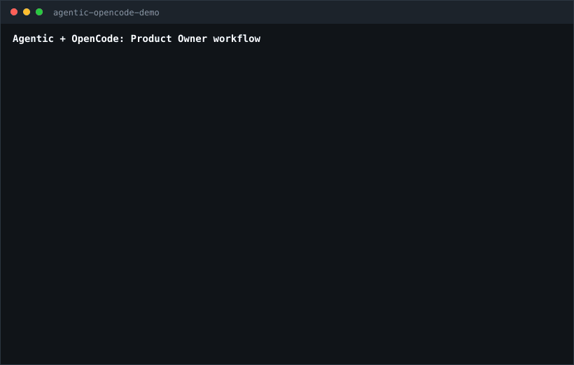

# Agent Intelligence Configuration (agentic)

> **18 areas · 10 Software specs · 8 DevOps specs · 7 SDLC agents + 2 specialists · 105+ skills · 73+ workflows**

A unified catalog of agentic specializations and the `agentic` CLI. Install orchestrator-ready rules, skills, workflows,
and prompts into any project — and run a full SDLC agent team out of the box.

- [Website](https://sawrus.github.io/agent-guides/)
- [Coverage scorecard](https://claude.ai/public/artifacts/8177bc3d-3b2f-48a6-8232-47c5b02b20f3)
- [CLI usage guide](docs/agentic-usage.md)
- [NPM package](https://www.npmjs.com/package/@jetrabbits/agentic)

## Coverage snapshot


Coverage report for the current catalog across areas, specs, skills, and workflows.

---

## Why agent-guides is different

Most agent prompt libraries give you a smarter *single agent*. agent-guides gives you a **coordinated team**:

```
@product-owner → @team-lead → @developer → @qa → @devops-engineer
```

Each role has hard boundaries, explicit handoff criteria, and measurable success metrics. The Product Owner orchestrates
the full SDLC; no other agent library ships this out of the box.

Works with **Claude Code**, **opencode**, **Cursor**, **Codex**, **kilocode**, **antigravity** and **Gemini**.

---

## What this is

agent-guides is a structured knowledge base for AI coding agents. Instead of writing long system prompts, you install
focused, composable guidance files that agents load on demand based on the task at hand.

Each **area** (e.g., `devops/kubernetes`) provides:

| File type           | Purpose                                   | When loaded                        |
|:--------------------|:------------------------------------------|:-----------------------------------|
| `AGENTS.md`         | Navigation index, load order, constraints | First — always                     |
| `rules/*.md`        | Hard constraints the agent must follow    | Always, for the active spec        |
| `skills/*/SKILL.md` | Technical capabilities and patterns       | On demand, matching "When to load" |
| `workflows/*.md`    | Orchestrated step-by-step processes       | On `/command` trigger              |
| `prompts/*.md`      | Human copy-paste templates (EN + RU)      | Reference / paste                  |

---

## Repository structure

```text
agent-guides/
├── areas/
│   ├── software/              # Application development
│   │   ├── general/           # Shared baseline — all software specs inherit from here
│   │   ├── backend/           # REST/GraphQL APIs, services, database access
│   │   ├── frontend/          # Components, accessibility, performance, CSS
│   │   ├── full-stack/        # End-to-end product features
│   │   ├── data-engineering/  # dbt, warehouses, pipelines, streaming
│   │   ├── mlops/             # Training, evaluation, serving, monitoring
│   │   ├── mobile/            # iOS, Android, React Native, Flutter
│   │   ├── platform/          # K8s manifests, IaC, CI/CD, secrets
│   │   ├── qa/                # Test strategy, coverage, flakiness, performance
│   │   └── security/          # Threat modeling, SAST/DAST, auth, compliance
│   └── devops/                # Platform and operations
│       ├── kubernetes/        # Cluster bootstrap, workload ops, RBAC, upgrades
│       ├── ci-cd/             # GitHub Actions, GitLab CI, quality gates, supply chain
│       ├── infrastructure/    # Terraform, Ansible, IaC standards, drift detection
│       ├── observability/     # Prometheus, Loki, Tempo, Grafana, SLOs
│       ├── sre/               # SLOs, error budgets, incidents, chaos engineering
│       ├── networking/        # Ingress, TLS, service mesh, DNS, VPC
│       ├── devsecops/         # Shift-left, SBOM, OPA/Kyverno, container hardening
│       └── database-ops/      # PostgreSQL, Redis, migrations, backup/restore
├── extensions/
│   ├── opencode/              # OpenCode agent definitions, commands, skills
│   │   └── agents/            # SDLC agents + optional specialists for .opencode/agents/
│   ├── claude/                # Claude Code configs
│   │   └── agents/            # SDLC agents + optional specialists for .claude/agents/
│   ├── antigravity/           # Antigravity platform configs
│   ├── codex/                 # Codex custom agents and override configs
│   │   └── agents/            # SDLC agents + optional specialists for .codex/agents/
│   └── gemini/                # Gemini-specific configs
│   │   └── agents/            # SDLC agents + optional specialists for .gemini/agents/
├── areas/template/            # Authoring templates — start here for new content
├── docs/                      # Setup and usage guides
├── AGENTS.md                  # Root agent guidance (loaded into every project)
└── agentic                    # CLI installer
```

---

## Quick start

### Requirements

- required commands: `bash`, `python3`, `pip`, `pip3`, or `python3 -m pip`, `git`
- optional commands: `fzf`, `node`/`npm`, `curl`, agent binaries such as `codex`, `opencode`, `claude`, `gemini`

### Install

```bash
npx @jetrabbits/agentic@latest
```

Alternative bootstrap (installs local binary):

```bash
curl -fsSL https://raw.githubusercontent.com/sawrus/agent-guides/main/install | bash
```

### Run

```bash
agentic
```

### Upgrade

```bash
agentic upgrade
```

### Full instructions

- [CLI usage guide](docs/agentic-usage.md)
- [Installed CLI lifecycle](docs/agentic-lifecycle.md)

## See agentic in action



Interactive walkthrough of the `agentic` CLI flow: choose a target project, pick agent platforms, and install the
guidance bundle.

---

## SDLC Agent team

The same 7-agent SDLC team works across **Claude Code**, **OpenCode**, **Codex**, and any tool that supports agent or
subagent files. Agentic also ships optional post-task review specialists for instruction quality and memory hygiene.

| Agent             | Role                                           | Invoke when                                   |
|:------------------|:-----------------------------------------------|:----------------------------------------------|
| `product-owner`   | Scope, acceptance criteria, SDLC orchestration | Start of any feature; final acceptance        |
| `pm`              | Planning, milestones, risk register            | Scope is defined, execution needs tracking    |
| `team-lead`       | Architecture, code review, quality gates       | Planning and pre-release sign-off             |
| `developer`       | Implementation, tests, delivery                | Implementation plan is approved               |
| `qa`              | Verification, defect classification, go/no-go  | Developer hands off an increment              |
| `designer`        | UX flows, accessibility, design-system review  | Planning and implementation review            |
| `devops-engineer` | CI/CD, IaC, platform reliability               | Anything touching infra, pipelines, or deploy |

Each agent has a `vibe` (one-line personality), `Identity`, `Communication Style`, `Success Metrics`, and explicit
`Boundaries` — so roles never overlap and handoffs are always documented.

Optional specialist agents run outside the mandatory SDLC role matrix:

| Agent                  | Role                                             | Invoke when                                      |
|:-----------------------|:-------------------------------------------------|:-------------------------------------------------|
| `instruction_reviewer` | Post-task instruction effectiveness review       | Instructions, tool use, or role guidance changed |
| `memory_curator`       | Post-task memory hygiene recommendations         | Durable facts or memory quality need review      |

See [Review Pipeline](docs/review-pipeline.md) for the guidance-mode pipeline and `.reviews/<task-id>/` output
convention.

| Platform    | Agent path                      | Format                         | Guide                                                                                           |
|:------------|:--------------------------------|:-------------------------------|:------------------------------------------------------------------------------------------------|
| Claude Code | `project/.claude/agents/*.md`   | Markdown with YAML frontmatter | [Claude Code subagents](https://docs.claude.com/en/api/agent-sdk/subagents)                     |
| OpenCode    | `project/.opencode/agents/*.md` | Markdown with frontmatter      | [OpenCode agents](https://opencode.ai/docs/agents/) · [repo setup note](docs/opencode_setup.md) |
| Codex       | `project/.codex/agents/*.toml`  | TOML custom agents             | [Codex subagents](https://developers.openai.com/codex/subagents)                                |
| Gemini      | `project/.gemini/agents/*.toml` | Markdown with YAML frontmatter | [Gemini subagents](https://geminicli.com/docs/core/subagents)                                   |

---

## What gets installed where

`agentic` installs shared guidance into `.agent/` and selected IDE files into directories like `.claude/`,
`.opencode/`, and `.codex/`. Generated runtime guidance goes to `AGENTS.md`; OpenCode also gets `.opencode/AGENTS.md`.

```text
project/.agent/
├── rules/       ← constraints active for every task in this project
├── skills/      ← capabilities loaded on demand
├── workflows/   ← processes triggered by slash commands
└── prompts/     ← human-paste templates
```

---

## Agent IDE options (interactive install)

### MCP

- `context7`: adds a remote MCP server for up-to-date framework, library, SDK, and API documentation.
- `mempalace`: adds a local memory MCP server for project context discovery and reuse.

### OpenCode Plugins

- `telegram-opencode-notifier`: sends Telegram notifications when an OpenCode session becomes idle, including the final
  response or an attachment for long output.
- `agent-model-mapper`: maps `.opencode/agents/*.md` roles to main and fallback OpenCode models during interactive
  `agentic install`/`agentic tui`. OpenCode startup never prompts or writes project files.

---

## Contributing

See [CONTRIBUTING.md](CONTRIBUTING.md) for authoring standards, templates, and the pull request process.

Quick checklist before opening a PR:

- [ ] Used the appropriate template from `areas/template/`.
- [ ] No `{{PLACEHOLDER}}` values remain.
- [ ] Spec map in `AGENTS.md` updated.
- [ ] Constraints in rules use imperative language.
- [ ] Prompt examples include both EN and RU blocks.

---

## License

See [LICENSE](LICENSE) if present, or contact the maintainers.
