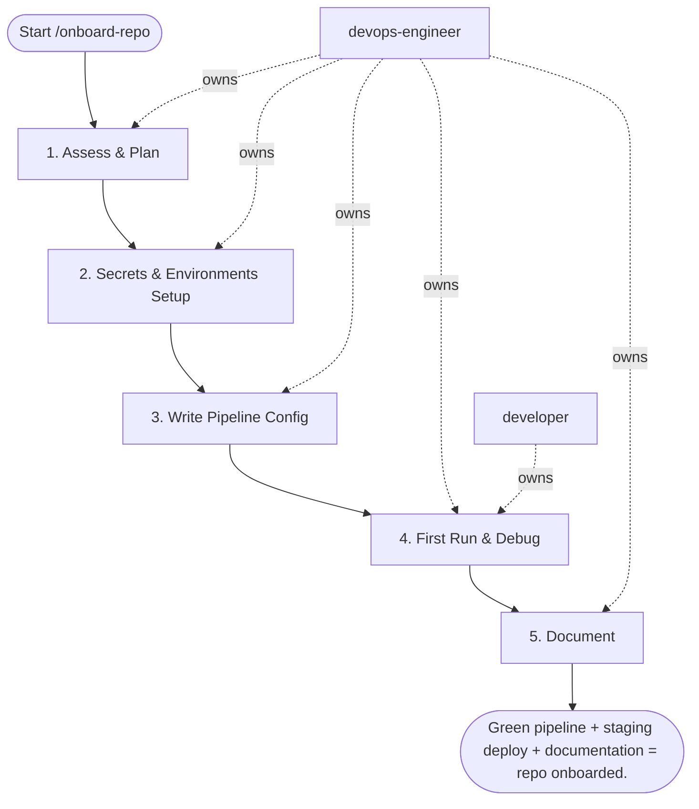

## Steps

### 1. Assess & Plan — `@devops-engineer`
- **Input:** repo_name, language/framework, ci_platform, and deploy_target from the workflow inputs.
- **Actions:**
  - Confirm language, build tool, test framework
  - Identify external dependencies (registry, cloud, K8s cluster)
  - Choose CI platform (GitHub Actions vs GitLab CI) based on repo location
  - Identify secrets needed: registry creds, kubeconfig, cloud role
- **Output:** pipeline design doc (stages, auth method, environments)
- **Done when:** design approved by developer and team-lead

### 2. Secrets & Environments Setup — `@devops-engineer`
- **Input:** approved pipeline design doc from step 1.
- **Actions:**
  - Create OIDC cloud role (preferred) or minimal-privilege service account
  - Configure CI secrets: registry login, kubeconfig (base64), vault token
  - Create environment definitions (staging, production) with protection rules
- **Done when:** secrets configured; OIDC trust policy in place

### 3. Write Pipeline Config — `@devops-engineer`
- **Input:** configured secrets and environment definitions from step 2.
- **Actions:**
  - Create `.github/workflows/ci.yml` or `.gitlab-ci.yml`
  - Implement all mandatory stages (lint → test → build → scan → deploy)
  - Add caching for dependencies (pip/npm/go modules)
  - Add image signing (cosign) and SBOM generation
  - Configure coverage reporting and test result upload
- **Output:** pipeline config committed to feature branch
- **Done when:** `yamllint` passes; no syntax errors

### 4. First Run & Debug — `@devops-engineer` + `@developer`
- **Input:** pipeline config committed to the feature branch in step 3.
- **Actions:**
  - Open PR to trigger pipeline
  - Fix any failing stages (missing deps, wrong paths, auth issues)
  - Verify each stage output matches expectations
- **Done when:** all stages green on PR; deployment to staging succeeds

### 5. Document — `@devops-engineer`
- **Input:** green pipeline and staging deployment from step 4.
- Write `docs/ci-cd.md`: stages, how to run locally, how to add a new secret
- **Done when:** documentation committed

## Agent Interaction Diagram

<!-- agent-diagram:start -->

<!-- agent-diagram:end -->

## Exit
Green pipeline + staging deploy + documentation = repo onboarded.

**Next:** terminal — no follow-up workflow.
