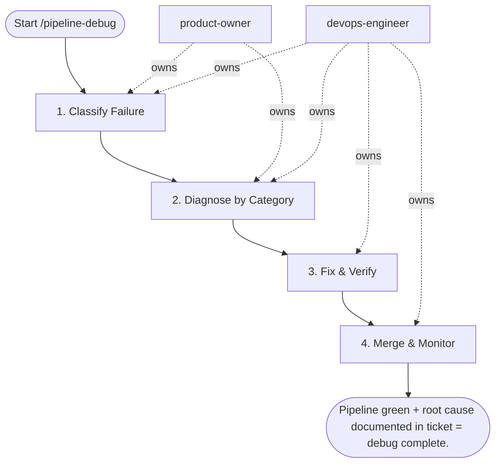

## Steps

1. Classify Failure — `@product-owner` + `@devops-engineer`
- Fetch full logs; identify failing stage and step
- Categories: dependency install failure / test failure / auth failure / build failure / deploy timeout
- Check: is this a flaky test or a real regression? (re-run once to distinguish)
- **Done when:** failure mode and stage identified

### 2. Diagnose by Category

**Auth failure (registry, cloud, K8s):**
- Check secret expiry / OIDC trust policy / runner network access
- `kubectl auth can-i` / `aws sts get-caller-identity` in job debug step

**Dependency install failure:**
- Cache key stale? Lock file changed? Private registry down?
- Add `--verbose` flag, check resolver output

**Test failure:**
- Run tests locally with same env vars
- Check for env-dependent tests (timezone, locale, missing fixture)

**Build/Docker failure:**
- Check base image digest changed (pin to digest)
- Layer cache invalidation causing unexpected rebuild

**Deploy timeout:**
- Check `helm status` / `kubectl rollout status` in target namespace
- Look at pod events for the deployment being rolled out

### 3. Fix & Verify — `@devops-engineer`
- Apply fix on feature branch; push to trigger CI
- Confirm the previously failing stage now passes
- No unrelated regressions in other stages
- **Done when:** full pipeline green on fix branch

### 4. Merge & Monitor — `@devops-engineer`
- Merge fix; confirm pipeline green on main
- If flaky test: add to quarantine list; file follow-up ticket with `flaky-test` label

## Agent Interaction Diagram

<!-- agent-diagram:start -->

<!-- agent-diagram:end -->

## Exit
Pipeline green + root cause documented in ticket = debug complete.
