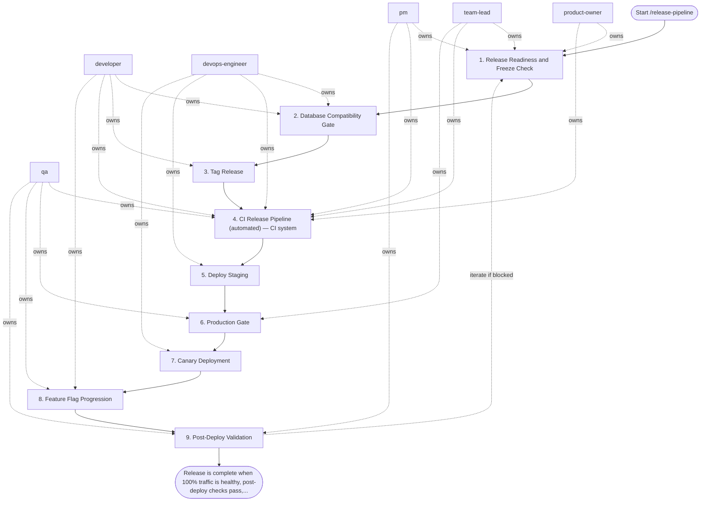

## Steps

1. Release Readiness and Freeze Check — `@product-owner` + `@team-lead` + `@pm`
- **Actions:**
  - Confirm no active P0/P1 incidents.
  - Confirm release window is approved (freeze policy respected).
  - Assign release owner, rollback owner, and incident commander.
  - Confirm stakeholder communication plan (`#deployments`, support, customer-facing status if needed).
- **Done when:** readiness checklist signed by team-lead.

### 2. Database Compatibility Gate — `@developer` + `@devops-engineer`
- **Actions:**
  - Validate schema changes follow **expand/contract** strategy.
  - Forbid destructive migrations in same release as dependent app change.
  - Ensure old and new app versions can run concurrently during canary.
  - Prepare rollback-safe migration plan.
- **Done when:** DB compatibility checklist is green.

### 3. Tag Release — `@developer`
```bash
git tag -a v${VERSION} -m "Release v${VERSION}: ${RELEASE_NOTES}"
git push origin v${VERSION}
```
- **Done when:** tag-triggered pipeline starts.

### 4. CI Release Pipeline (automated) — CI system
- **Stages:**
  1. `validate` — lint/test/type/security checks.
  2. `build` — immutable image digest produced.
  3. `sign` — keyless `cosign sign` on digest.
  4. `attest` — SLSA provenance generated.
  5. `sbom` — CycloneDX/SPDX SBOM generated + attached.
  6. `verify` — signature/provenance identity checks.
  7. `publish` — publish artifact and release notes.
- **Done when:** pipeline green with verifiable artifact metadata.

### 5. Deploy Staging — `@devops-engineer`
```bash
helm upgrade --install order-service charts/order-service \
  --set image.digest=sha256:${DIGEST} \
  --namespace staging \
  --atomic --timeout 10m
```
- Run smoke + integration critical path tests.
- Observe golden signals for at least 15 minutes.
- **Done when:** staging stable and tests pass.

### 6. Production Gate — `@team-lead` + `@qa`
- **Actions:**
  - Confirm error budget not exhausted.
  - Confirm rollback command and previous digest ready.
  - Confirm canary SLO thresholds and observation duration are set.
- **Done when:** manual approval is recorded.

### 7. Canary Deployment — `@devops-engineer`
- **Sequence:**
  - 5% traffic for 10 min.
  - 25% traffic for 15 min.
  - 50% traffic for 15 min (high-risk releases only).
  - 100% traffic only if all gates pass.
- **Automatic rollback triggers (example baseline):**
  - 5xx rate > 1% for 5 min,
  - p99 latency regression > 20% for 10 min,
  - fast burn-rate alert firing (>14.4x, 1h window).

### 8. Feature Flag Progression — `@developer` + `@qa`
- Keep high-risk features behind flags during rollout.
- Enable by cohorts (internal → 5% users → 25% → 100%).
- Roll back by disabling flag if service health degrades without binary rollback.

### 9. Post-Deploy Validation — `@qa` + `@pm`
- Run production smoke checks.
- Verify business KPIs (conversion, checkout success, error funnel).
- Publish deployment report with links to metrics, logs, and release artifact metadata.

## Agent Interaction Diagram

<!-- agent-diagram:start -->

<!-- agent-diagram:end -->

## Rollback

```bash
helm rollback order-service -n production
# or redeploy previous verified digest
```

- Rollback is mandatory when any SLO rollback trigger is met.
- If DB migrations were expanded, execute rollback-safe contract plan only after traffic is stable.

## Exit

Release is complete when 100% traffic is healthy, post-deploy checks pass, and release report is published.
