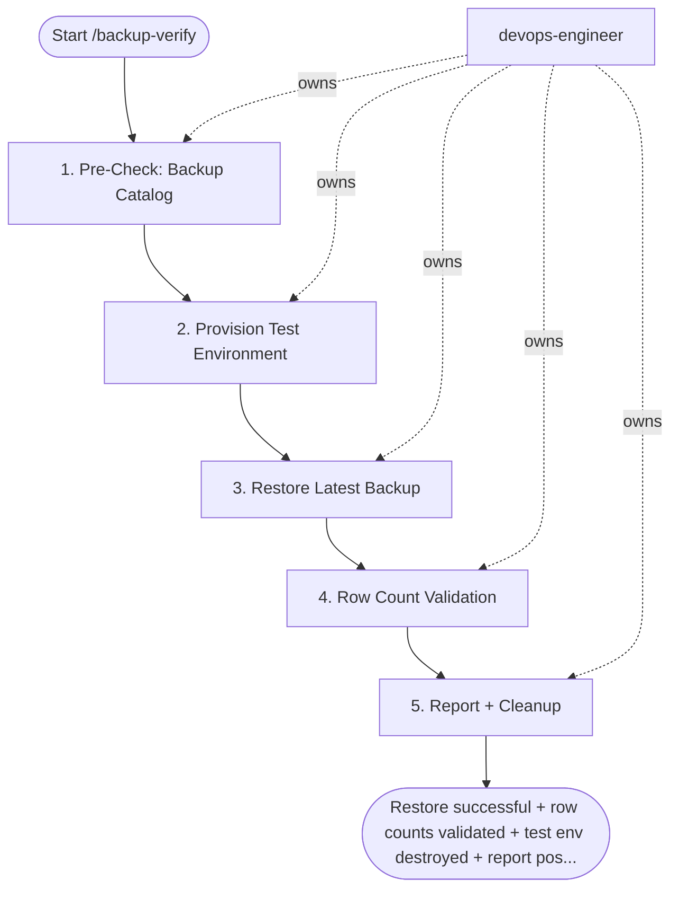

## Steps

### 1. Pre-Check: Backup Catalog — `@devops-engineer`
```bash
# pgBackRest
pgbackrest --stanza=main info

# Verify: last full backup age < 24h; WAL archiving current
# Exit non-zero if no backup found → alert on-call immediately
LAST_FULL=$(pgbackrest --stanza=main info --output=json | jq -r '.[] | .backup[-1].timestamp.stop')
AGE_HOURS=$(( ( $(date +%s) - $LAST_FULL ) / 3600 ))
if [ $AGE_HOURS -gt 26 ]; then
  echo "ALERT: Last backup is ${AGE_HOURS}h old (> 26h threshold)" && exit 1
fi
```
- **Done when:** backup catalog exists, last backup < 26h old

### 2. Provision Test Environment — `@devops-engineer`
```bash
# Spin up isolated postgres pod for restore test
kubectl run restore-test \
  --image=postgres:16-alpine \
  --env="POSTGRES_PASSWORD=testpass" \
  --restart=Never \
  -n database-ops
kubectl wait pod/restore-test --for=condition=Ready --timeout=60s
```

### 3. Restore Latest Backup — `@devops-engineer`
```bash
# Restore to test pod (pgBackRest delta restore is faster if data dir pre-exists)
pgbackrest --stanza=main restore \
  --pg1-path=/var/lib/postgresql/data \
  --target-action=promote \
  --delta

# Start postgres and confirm it accepts connections
pg_ctl start -D /var/lib/postgresql/data
psql -c "SELECT 1" postgres  # must succeed
```
- **Done when:** postgres starts cleanly; no recovery errors in log

### 4. Row Count Validation — `@devops-engineer`
```bash
# Compare critical table row counts: restored vs production
TABLES="orders payments users products"
for table in $TABLES; do
  PROD=$(psql -h postgres-primary -c "SELECT count(*) FROM $table" -t | tr -d ' ')
  REST=$(psql -h restore-test-svc   -c "SELECT count(*) FROM $table" -t | tr -d ' ')
  DIFF=$(echo "scale=4; ($PROD - $REST) / $PROD * 100" | bc)
  echo "$table: prod=$PROD restored=$REST diff=$DIFF%"
  # Alert if diff > 1%
done
```
- **Done when:** all critical tables within 1% row count of production

### 5. Report + Cleanup — `@devops-engineer`
```bash
# Destroy test pod immediately after verification
kubectl delete pod restore-test -n database-ops

# Write report
cat > backup-verify-$(date +%Y%m%d).txt << EOF
Date: $(date -u)
Backup age: ${AGE_HOURS}h
Restore: SUCCESS
Tables validated: $TABLES
Row count drift: all within 1%
Test env: destroyed
EOF

# Post result to Slack
curl -X POST $SLACK_WEBHOOK \
  -H 'Content-type: application/json' \
  --data "{\"text\":\"✅ DB backup verified $(date +%Y-%m-%d) — restore successful, all tables within 1%\"}"
```
- **If any step fails:** post failure to Slack + page on-call → P1 incident

## Agent Interaction Diagram

<!-- agent-diagram:start -->

<!-- agent-diagram:end -->

## Exit
Restore successful + row counts validated + test env destroyed + report posted = backup verified.
