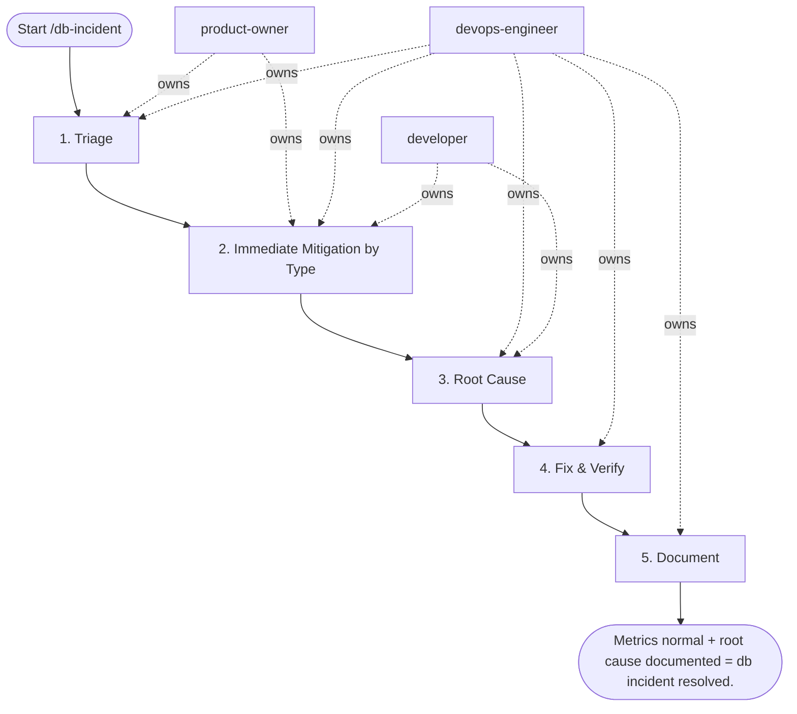

## Steps

1. Triage — `@product-owner` + `@devops-engineer`
- Check: connection count, active queries, lock waits, replication lag
```sql
SELECT count(*), state FROM pg_stat_activity GROUP BY state;
SELECT * FROM pg_stat_replication;
```
- Check PgBouncer: `SHOW POOLS; SHOW STATS;`
- **Done when:** failure mode classified (connection exhaustion / lock / slow query / replication)

### 2. Immediate Mitigation by Type

**Connection exhaustion (max_connections reached):**
```sql
-- Kill idle connections (not in transaction)
SELECT pg_terminate_backend(pid)
FROM pg_stat_activity
WHERE state = 'idle' AND query_start < now() - interval '30 minutes';
```
- Check PgBouncer pool size — increase `default_pool_size` in pgbouncer.ini; `RELOAD`

**Lock contention:**
```sql
-- Identify and kill blocking query (after confirming safe)
SELECT pg_terminate_backend(<blocking_pid>);
```

**Slow query (high CPU, degraded performance):**
```sql
-- Find and kill runaway query
SELECT pid, query_start, state, query FROM pg_stat_activity
WHERE state = 'active' ORDER BY query_start ASC LIMIT 10;
SELECT pg_cancel_backend(<pid>);   -- graceful
SELECT pg_terminate_backend(<pid>); -- forceful
```

**Replication lag > RPO threshold:**
- Check WAL receiver on replica: `SELECT * FROM pg_stat_wal_receiver;`
- Check network between primary and replica
- If lag growing: consider increasing `wal_sender_timeout`

### 3. Root Cause — `@devops-engineer` + `@developer`
- Check `pg_stat_statements` for query regressions (new slow query after deploy?)
- Check recent schema migrations (new index missing? index not created concurrently?)
- Review application logs for query pattern change

### 4. Fix & Verify — `@devops-engineer`
- Apply fix (create missing index, kill leaked connections, tune pgbouncer)
- Watch metrics stabilize over 5 min
- **Done when:** connection count normal, query latency normal, no lock waits

### 5. Document — `@devops-engineer`
- Root cause + fix in incident ticket
- If query regression: create optimization ticket for development team

## Agent Interaction Diagram

<!-- agent-diagram:start -->

<!-- agent-diagram:end -->

## Exit
Metrics normal + root cause documented = db incident resolved.
