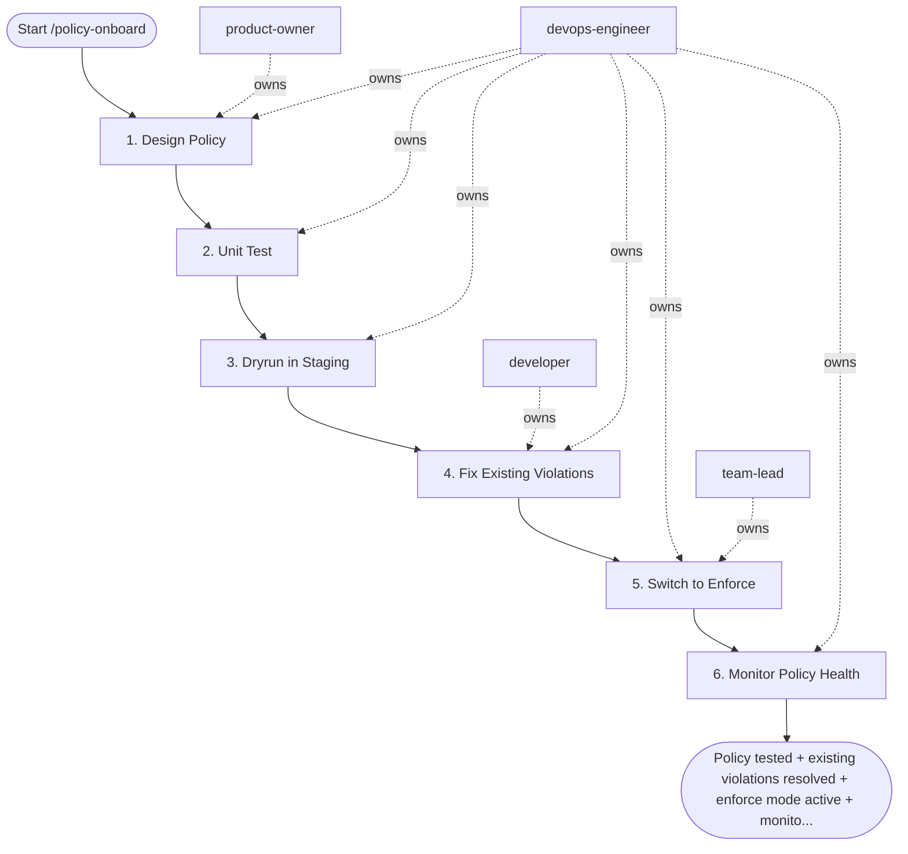

## Steps

1. Design Policy — `@product-owner` + `@devops-engineer`
- What is the policy checking? (privilege escalation / missing limits / bad image tag)
- Which resource types and namespaces does it apply to?
- What is the enforcement mode for each environment?
  - staging: `warn` or `dryrun` → gather data, don't break things
  - production: `deny` (after staging validation)
- Write policy in Rego (Gatekeeper) or YAML (Kyverno)

### 2. Unit Test — `@devops-engineer`
```bash
# Gatekeeper / OPA
opa test policies/ -v --ignore='*_test.rego'

# Kyverno
kyverno test . --test-case-selector "policy=${POLICY_NAME}"

# Manual: apply failing manifest and expect rejection
kubectl apply --dry-run=server -f test/failing-manifest.yaml
# Should output: "admission webhook ... denied"

kubectl apply --dry-run=server -f test/passing-manifest.yaml
# Should output: "... configured (dry run)"
```
- **Done when:** unit tests pass; both positive and negative cases covered

### 3. Dryrun in Staging — `@devops-engineer`
```bash
# Gatekeeper: deploy with dryrun enforcement
kubectl apply -f policies/gatekeeper/constraints/${POLICY}-staging.yaml
# enforcement_action: dryrun   ← logs violations, does not block

# Wait 10 minutes, then check for violations
kubectl get constraint ${POLICY} -o json | \
  jq '.status.violations'

# Kyverno: audit mode
# spec.validationFailureAction: Audit   ← logs, does not block
kubectl get polr -n ${NAMESPACE}   # policy reports
```
- Document: which existing workloads would be blocked if set to `deny`?
- For each violation: fix workload OR create documented exception

### 4. Fix Existing Violations — `@developer` + `@devops-engineer`
- For each dryrun violation: fix the workload manifest (add securityContext, resource limits, etc.)
- Create tracking tickets for violations that require code changes
- **Do not proceed to enforce until existing violations are resolved**

### 5. Switch to Enforce — `@devops-engineer` + `@team-lead`
```bash
# After all violations resolved in staging:
# Update constraint enforcement action
kubectl patch constraint ${POLICY} \
  --type=merge \
  -p '{"spec":{"enforcementAction":"deny"}}'

# Verify: try deploying a non-compliant manifest
kubectl apply --dry-run=server -f test/failing-manifest.yaml
# Must be rejected
```
- Apply same enforce mode to production after staging confirmed clean
- Announce in #devops-changes: "Policy ${POLICY} now enforcing in production"

### 6. Monitor Policy Health — `@devops-engineer`
```bash
# Gatekeeper: ongoing violation audit (runs every 60s)
kubectl get constraint ${POLICY} -o jsonpath='{.status.byPod}'

# Set up Prometheus alert for policy violations
# metric: gatekeeper_violations_total{enforcement_action="deny"}
```

## Agent Interaction Diagram

<!-- agent-diagram:start -->

<!-- agent-diagram:end -->

## Exit
Policy tested + existing violations resolved + enforce mode active + monitoring in place = policy onboarded.
