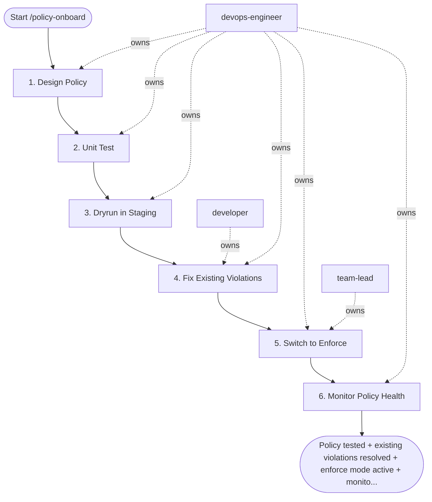

## Steps

### 1. Design Policy — `@devops-engineer`
- **Input:** policy_name, engine, target_namespaces, and enforcement_action from the workflow inputs.
- What is the policy checking? (privilege escalation / missing limits / bad image tag)
- Which resource types and namespaces does it apply to?
- What is the enforcement mode for each environment?
  - staging: `warn` or `dryrun` → gather data, don't break things
  - production: `deny` (after staging validation)
- Write policy in Rego (Gatekeeper) or YAML (Kyverno)
- **Done when:** policy written with scope, resource types, and per-environment enforcement mode defined.

### 2. Unit Test — `@devops-engineer`
- **Input:** drafted policy from step 1.
```bash
# Gatekeeper / OPA
opa test policies/ -v --ignore='*_test.rego'

# Kyverno
kyverno test . --test-case-selector "policy=${POLICY_NAME}"

# Manual: apply failing manifest and expect rejection
kubectl apply --dry-run=server -f test/failing-manifest.yaml
# Should output: "admission webhook ... denied"

kubectl apply --dry-run=server -f test/passing-manifest.yaml
# Should output: "... configured (dry run)"
```
- **Done when:** unit tests pass; both positive and negative cases covered

### 3. Dryrun in Staging — `@devops-engineer`
- **Input:** unit-tested policy from step 2.
```bash
# Gatekeeper: deploy with dryrun enforcement
kubectl apply -f policies/gatekeeper/constraints/${POLICY}-staging.yaml
# enforcement_action: dryrun   ← logs violations, does not block

# Wait 10 minutes, then check for violations
kubectl get constraint ${POLICY} -o json | \
  jq '.status.violations'

# Kyverno: audit mode
# spec.validationFailureAction: Audit   ← logs, does not block
kubectl get polr -n ${NAMESPACE}   # policy reports
```
- Document: which existing workloads would be blocked if set to `deny`?
- For each violation: fix workload OR create documented exception
- **Done when:** dryrun violations collected; each has a fix plan or documented exception.

### 4. Fix Existing Violations — `@developer` + `@devops-engineer`
- **Input:** dryrun violation list from step 3.
- For each dryrun violation: fix the workload manifest (add securityContext, resource limits, etc.)
- Create tracking tickets for violations that require code changes
- **Do not proceed to enforce until existing violations are resolved** — track violation burn-down for at most 2 review cycles; if violations remain, escalate to `@team-lead` to either grant time-boxed exceptions (with expiry dates) or descope the policy. Do not wait indefinitely.
- **Done when:** all violations fixed or covered by a tracked, time-boxed exception.

### 5. Switch to Enforce — `@devops-engineer` + `@team-lead`
- **Input:** resolved violation list from step 4.
```bash
# After all violations resolved in staging:
# Update constraint enforcement action
kubectl patch constraint ${POLICY} \
  --type=merge \
  -p '{"spec":{"enforcementAction":"deny"}}'

# Verify: try deploying a non-compliant manifest
kubectl apply --dry-run=server -f test/failing-manifest.yaml
# Must be rejected
```
- Apply same enforce mode to production after staging confirmed clean
- Announce in #devops-changes: "Policy ${POLICY} now enforcing in production"
- **Done when:** failing manifest rejected in staging and production; change announced in #devops-changes.

### 6. Monitor Policy Health — `@devops-engineer`
- **Input:** enforced policy from step 5.
```bash
# Gatekeeper: ongoing violation audit (runs every 60s)
kubectl get constraint ${POLICY} -o jsonpath='{.status.byPod}'

# Set up Prometheus alert for policy violations
# metric: gatekeeper_violations_total{enforcement_action="deny"}
```
- Record the enforced policy in `docs/policies/<policy-name>.md` — scope, enforcement mode, exceptions, and owner.
- **Done when:** violation alert configured and policy recorded in `docs/policies/<policy-name>.md`.

## Agent Interaction Diagram

<!-- agent-diagram:start -->

<!-- agent-diagram:end -->

## Exit
Policy tested + existing violations resolved + enforce mode active + monitoring in place = policy onboarded.

**Next:** terminal — no follow-up workflow.
