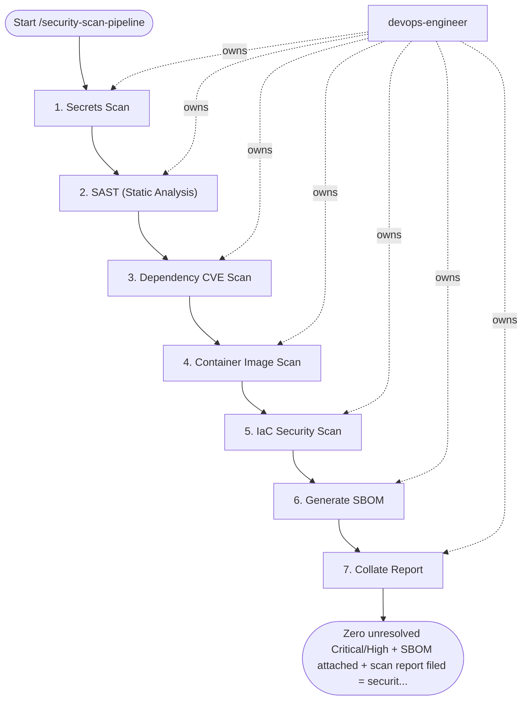

## Steps

### 1. Secrets Scan — `@devops-engineer`
- **Input:** service_name, version_or_sha, and scan_scope from the workflow inputs.
```bash
# Scan git history for secrets
trufflehog git file://. \
  --since-commit HEAD~20 \
  --only-verified \
  --fail

# Scan current working tree
gitleaks detect --source . --config .gitleaks.toml --exit-code 1
```
- **Done when:** zero verified secrets found; false positives documented in `.gitleaksignore`

### 2. SAST (Static Analysis) — `@devops-engineer`
- **Input:** clean secrets scan from step 1.
```bash
# semgrep (language-aware rules)
semgrep scan \
  --config=p/python         \
  --config=p/owasp-top-ten  \
  --config=p/secrets        \
  --error                   \   # non-zero exit on findings
  --output=sast-results.sarif \
  --sarif                   \
  src/

# Upload to GitHub Security tab
gh api -X POST repos/:owner/:repo/code-scanning/sarifs \
  -f ref="refs/heads/main" \
  -f sarif="$(cat sast-results.sarif | gzip | base64)"
```
- Block on: Critical/High severity findings without suppression comment
- **Done when:** clean or all findings triaged with `# nosemgrep` + justification

### 3. Dependency CVE Scan — `@devops-engineer`
- **Input:** triaged SAST results from step 2.
```bash
# Scan source dependencies (before build)
trivy fs . \
  --severity CRITICAL,HIGH \
  --exit-code 1 \
  --format table \
  --ignorefile .trivyignore

# Language-specific (alternative)
# Python
pip-audit -r requirements.txt --fail-on-severity high
# Node
npm audit --audit-level=high
# Go
govulncheck ./...
```
- **Done when:** zero unsuppressed Critical/High CVEs; accepted risks documented in `.trivyignore`.

### 4. Container Image Scan — `@devops-engineer`
- **Input:** built image for version_or_sha and CVE baseline from step 3.
```bash
IMAGE=registry.example.com/myorg/${SERVICE}:${VERSION}

trivy image \
  --severity CRITICAL,HIGH \
  --exit-code 1 \
  --format sarif \
  --output image-scan.sarif \
  --ignorefile .trivyignore \
  ${IMAGE}

# Also scan for misconfiguration in image layers
trivy image \
  --scanners misconfig \
  --exit-code 0 \   # warn only for misconfig
  ${IMAGE}
```
- **Done when:** image scan clean of unsuppressed Critical/High findings; misconfig warnings reviewed.

### 5. IaC Security Scan — `@devops-engineer`
- **Input:** IaC sources in scan_scope (`terraform/`, `charts/`) and clean image scan from step 4.
```bash
# Terraform
checkov -d terraform/ \
  --quiet \
  --compact \
  --framework terraform \
  --output sarif \
  --output-file-path iac-scan.sarif

# Or: tfsec
tfsec terraform/ \
  --format sarif \
  --out tfsec.sarif

# K8s manifests
checkov -d charts/${SERVICE}/templates \
  --framework kubernetes \
  --quiet
```
- **Done when:** IaC scans complete with no unaddressed Critical/High findings.

### 6. Generate SBOM — `@devops-engineer`
- **Input:** scanned image digest from step 4.
```bash
IMAGE_DIGEST=$(crane digest ${IMAGE})

# Generate CycloneDX SBOM
syft ${IMAGE} -o cyclonedx-json=sbom.cdx.json

# Attach as OCI attestation
cosign attest \
  --predicate sbom.cdx.json \
  --type cyclonedx \
  ${IMAGE}@${IMAGE_DIGEST}

echo "SBOM attached to ${IMAGE}@${IMAGE_DIGEST}"
```
- **Done when:** SBOM attested to the image digest in the registry.

### 7. Collate Report — `@devops-engineer`
- **Input:** scan outputs from steps 1–6.
```bash
# Write baseline report to the repo
mkdir -p docs/security
{
  echo "=== Security Scan Report: ${SERVICE} ${VERSION} ==="
  echo "Secrets:      $(cat secrets-results.json | jq length) findings"
  echo "SAST:         $(cat sast-results.sarif | jq '.runs[0].results | length') findings"
  echo "Dependencies: $(trivy fs . --quiet --format json 2>/dev/null | jq '.Results[].Vulnerabilities | length // 0' | paste -sd+ | bc) findings"
  echo "Image:        $(cat image-scan.sarif | jq '.runs[0].results | length') findings"
  echo "IaC:          $(cat iac-scan.sarif | jq '.runs[0].results | length') findings"
  echo "SBOM:         attached to registry"
} > docs/security/scan-baseline.md
```
- **Done when:** baseline report committed to `docs/security/scan-baseline.md`.

## Agent Interaction Diagram

<!-- agent-diagram:start -->

<!-- agent-diagram:end -->

## Exit
Zero unresolved Critical/High + SBOM attached + scan report filed = security scan complete. Scan outputs (findings_by_severity) feed the /release-pipeline readiness gate.

**Next:** terminal — no follow-up workflow.
