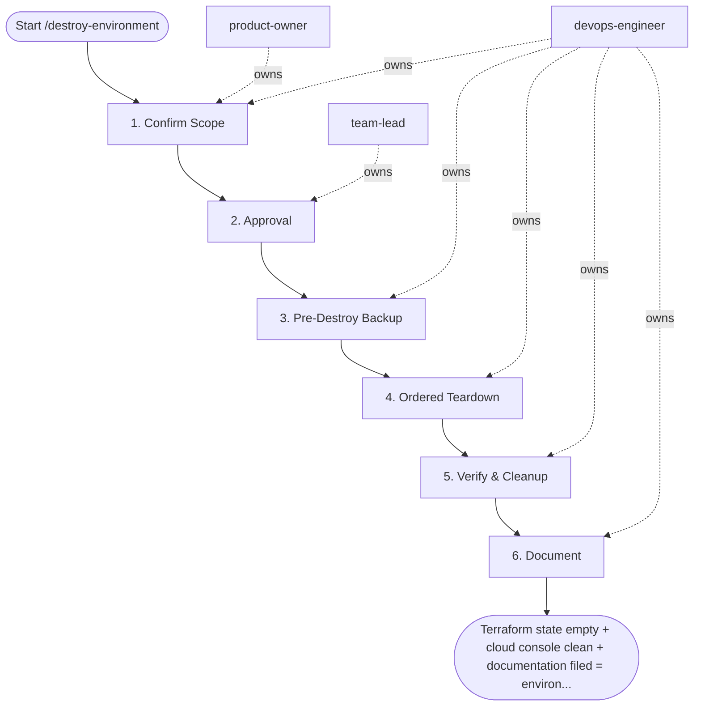

## Steps

1. Confirm Scope — `@product-owner` + `@devops-engineer`
- List all resources to be destroyed: `terraform plan -destroy -var-file=terraform.tfvars`
- Verify: is there **production data** in this environment? (databases, object storage)
- Confirm no active traffic or dependent services
- **Stop here if**: environment has active users or unarchived data

### 2. Approval — `@team-lead` (+ VP Eng if production)
- Review the destroy plan output
- Confirm: data archived or migrated
- Sign off in the PR/ticket: `APPROVED FOR DESTROY — [name] [date]`
- **Done when:** written approval recorded

### 3. Pre-Destroy Backup — `@devops-engineer`
```bash
# Back up Terraform state file
terraform state pull > backups/state-${ENV}-$(date +%Y%m%d-%H%M%S).tfstate

# If databases present: take final snapshot
pgbackrest --stanza=${ENV}-db --type=full backup

# Export any S3/GCS bucket contents if needed
aws s3 sync s3://${ENV}-data ./backups/s3-${ENV}/
```
- **Done when:** backups verified (not just initiated)

### 4. Ordered Teardown — `@devops-engineer`
```bash
# Destroy in reverse dependency order
# Workloads first, then networking, then storage last

# Option A: full destroy
terraform destroy -var-file=terraform.tfvars -auto-approve

# Option B: targeted destroy (preferred for partial teardown)
# 1. Destroy compute/K8s cluster first
terraform destroy -target=module.k8s_cluster -var-file=terraform.tfvars -auto-approve
# 2. Then networking
terraform destroy -target=module.vpc -var-file=terraform.tfvars -auto-approve
# 3. Finally storage (confirm buckets are empty first)
terraform destroy -target=module.object_storage -var-file=terraform.tfvars -auto-approve
```
- Watch for destroy errors; some resources require manual intervention (e.g., non-empty S3 buckets)

### 5. Verify & Cleanup — `@devops-engineer`
```bash
# Confirm no resources remain
terraform state list   # should be empty

# Remove backend state file (only after confirming destroy is complete)
# AWS S3:
aws s3 rm s3://mycompany-terraform-state/${ENV}/ --recursive
# GCS:
gsutil -m rm -r gs://mycompany-terraform-state/${ENV}/

# Remove DynamoDB lock entries
aws dynamodb delete-item \
  --table-name terraform-state-lock \
  --key '{"LockID": {"S": "mycompany-terraform-state/${ENV}/terraform.tfstate"}}'
```
- **Done when:** state list empty; DNS entries removed; cloud console confirms no resources

### 6. Document — `@devops-engineer`
- Record in decommission log: environment, date, approver, reason, data disposition

## Agent Interaction Diagram

<!-- agent-diagram:start -->

<!-- agent-diagram:end -->

## Exit
Terraform state empty + cloud console clean + documentation filed = environment destroyed.
