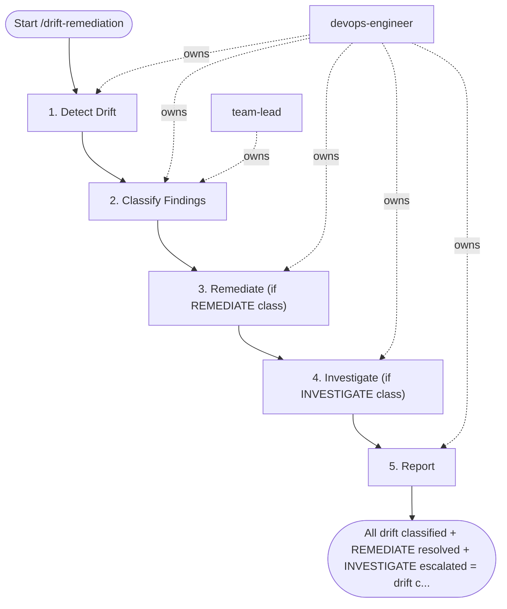

## Steps

### 1. Detect Drift — `@devops-engineer`
- **Input:** environment and optional component from trigger inputs
```bash
# Run plan across all components; capture exit code
# Exit 0 = no changes, Exit 2 = changes detected
terraform plan -var-file=terraform.tfvars -detailed-exitcode 2>&1 | tee drift-report.txt
echo "Exit code: $?"
```
- **Done when:** plan completes; `drift-report.txt` captured with exit code recorded

### 2. Classify Findings — `@devops-engineer` + `@team-lead`
- **Input:** `drift-report.txt` from step 1

| Class | Criteria | Action |
|:---|:---|:---|
| `ACCEPT` | Documented exception in PR comment | Suppress; add to ignore list |
| `REMEDIATE` | Unintended config change | Terraform apply within 48h |
| `INVESTIGATE` | Unknown origin; IAM/SG/encryption changes | Treat as P1; audit access logs |

- Any change to: IAM policies, security groups, encryption settings → **automatic INVESTIGATE**
- **Done when:** every finding assigned a class; classification list recorded for steps 3–4

### 3. Remediate (if REMEDIATE class) — `@devops-engineer`
- **Input:** REMEDIATE-classified findings from the step 2 classification list
```bash
# Review plan again — confirm only expected changes
terraform plan -var-file=terraform.tfvars -out=remediation.plan
# Apply after team-lead approval
terraform apply remediation.plan
```
- If `terraform apply` fails: stop and re-plan; maximum 2 re-plans, then escalate to `@team-lead` with the open blocker list
- **Done when:** remediation applied; follow-up plan shows no unexpected changes

### 4. Investigate (if INVESTIGATE class) — `@devops-engineer`
- **Input:** INVESTIGATE-classified findings from the step 2 classification list
- Trigger /incident-response (at most one automatic trigger per drift run; if the condition recurs, stop and escalate to a human decision)
- Engage `devops/devsecops` guidance if malicious drift is suspected
- Pull cloud provider audit logs (CloudTrail / GCP Audit Logs) for affected resource
- Identify who/what made the change and when
- Remediate AND file security incident report
- **Done when:** change origin identified; incident report filed

### 5. Report — `@devops-engineer`
- **Input:** classification and remediation/investigation outcomes from steps 2–4
- Update `docs/operations/drift-log.md` with date, resources affected, classification, action taken
- **Done when:** `docs/operations/drift-log.md` updated and committed

## Agent Interaction Diagram

<!-- agent-diagram:start -->

<!-- agent-diagram:end -->

## Exit
All drift classified + REMEDIATE resolved + INVESTIGATE escalated = drift cycle complete.

**Next:** terminal — no follow-up workflow.
