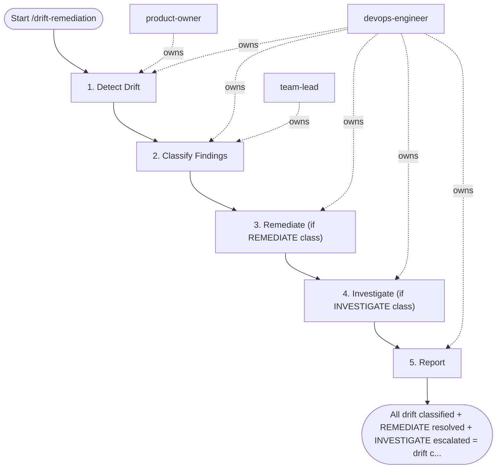

## Steps

1. Detect Drift — `@product-owner` + `@devops-engineer`
```bash
# Run plan across all components; capture exit code
# Exit 0 = no changes, Exit 2 = changes detected
terraform plan -var-file=terraform.tfvars -detailed-exitcode 2>&1 | tee drift-report.txt
echo "Exit code: $?"
```

### 2. Classify Findings — `@devops-engineer` + `@team-lead`

| Class | Criteria | Action |
|:---|:---|:---|
| `ACCEPT` | Documented exception in PR comment | Suppress; add to ignore list |
| `REMEDIATE` | Unintended config change | Terraform apply within 48h |
| `INVESTIGATE` | Unknown origin; IAM/SG/encryption changes | Treat as P1; audit access logs |

- Any change to: IAM policies, security groups, encryption settings → **automatic INVESTIGATE**

### 3. Remediate (if REMEDIATE class) — `@devops-engineer`
```bash
# Review plan again — confirm only expected changes
terraform plan -var-file=terraform.tfvars -out=remediation.plan
# Apply after team-lead approval
terraform apply remediation.plan
```

### 4. Investigate (if INVESTIGATE class) — `@devops-engineer` + security
- Open P1 incident
- Pull cloud provider audit logs (CloudTrail / GCP Audit Logs) for affected resource
- Identify who/what made the change and when
- Remediate AND file security incident report

### 5. Report — `@devops-engineer`
- Update `drift-log.md` with date, resources affected, classification, action taken

## Agent Interaction Diagram

<!-- agent-diagram:start -->

<!-- agent-diagram:end -->

## Exit
All drift classified + REMEDIATE resolved + INVESTIGATE escalated = drift cycle complete.
