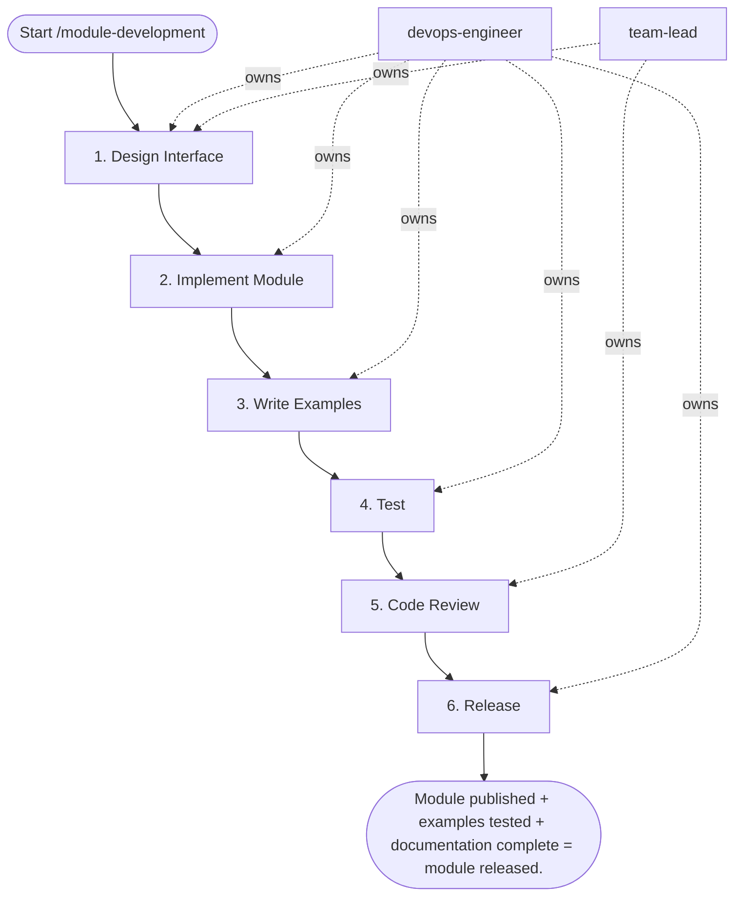

## Steps

### 1. Design Interface — `@devops-engineer` + `@team-lead`
- **Input:** module_name, module_purpose, cloud_targets from trigger inputs
- Define: what problem does this module solve?
- Map all input variables (required vs optional with defaults)
- Map all outputs callers will need
- Decide: cloud-specific or cloud-agnostic? (prefer agnostic with per-cloud examples)
- **Done when:** interface design reviewed and signed off

### 2. Implement Module — `@devops-engineer`
- **Input:** signed-off interface design from step 1
```
modules/<module-name>/
├── main.tf         ← resource definitions
├── variables.tf    ← all inputs with descriptions + validation
├── outputs.tf      ← all outputs with descriptions
├── versions.tf     ← required_version + required_providers (no provider block)
└── README.md       ← auto-generated with terraform-docs
```
- Add `validation {}` blocks to all critical variables
- Use `for_each` over `count` for multi-instance resources
- No hardcoded regions, account IDs, or environment names
- **Done when:** `terraform validate` passes; `terraform fmt -check` passes

### 3. Write Examples — `@devops-engineer`
- **Input:** module implementation from step 2
```
modules/<module-name>/examples/
├── basic/          ← minimal config, happy path
│   ├── main.tf
│   └── README.md
└── advanced/       ← all options exercised
    ├── main.tf
    └── README.md
```
- Examples must have complete provider configs
- Run each example against a test account/project: `terraform init && terraform plan`
- **Done when:** both examples produce a clean plan

### 4. Test — `@devops-engineer`
- **Input:** module and examples from steps 2–3
```bash
# Terratest (Go)
cd modules/<module-name>/test
go test -v -timeout 30m

# Or: checkov for static security analysis
checkov -d modules/<module-name>/ --quiet

# terraform-docs: generate README from code
terraform-docs markdown table modules/<module-name>/ \
  > modules/<module-name>/README.md
```
- If tests fail: fix the module and re-run; maximum 3 iterations, then stop and escalate to `@team-lead` with the open blocker list
- **Done when:** Terratest passes; checkov reports no failed checks; README regenerated

### 5. Code Review — `@team-lead`
- **Input:** module PR with implementation, examples, test results, and generated README from steps 2–4
- Interface is minimal (no unnecessary variables)
- No provider config in module
- Examples clean
- README complete (all variables, outputs, usage examples)
- **Done when:** PR approved

### 6. Release — `@devops-engineer`
- **Input:** approved PR from step 5
- Update the module `CHANGELOG.md` before tagging
```bash
# Semantic version tag
git tag -a modules/<module-name>/v1.0.0 \
  -m "Initial release of <module-name> module"
git push origin modules/<module-name>/v1.0.0

# Update module registry / internal docs
# Reference in other modules: ?ref=v1.0.0 (never ?ref=main)
```
- Post-release check: verify consumption — `terraform init` + plan against the basic example root referencing the published tag
- **Done when:** CHANGELOG updated and semver tag pushed; post-release consumption check produces a clean plan

## Agent Interaction Diagram

<!-- agent-diagram:start -->

<!-- agent-diagram:end -->

## Exit
Module published + examples tested + documentation complete = module released.

**Next:** terminal — no follow-up workflow.
