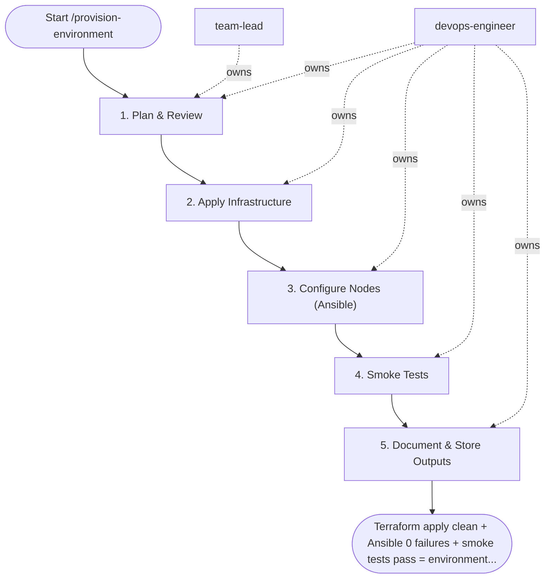

## Steps

### 1. Plan & Review — `@devops-engineer` + `@team-lead`
- **Actions:**
  ```bash
  cd terraform/environments/${ENV}
  terraform init -backend-config=backend.hcl
  terraform validate
  terraform fmt -check -recursive

  # Generate plan
  terraform plan \
    -var-file=terraform.tfvars \
    -out=tfplan.binary \
    2>&1 | tee tfplan.txt
  ```
- Review plan output for: unexpected destroys, missing tags, security group wildcards, unencrypted storage
- **Done when:** `@team-lead` approves plan; no unexpected destroys

### 2. Apply Infrastructure — `@devops-engineer`
- **Actions:**
  ```bash
  terraform apply tfplan.binary
  # Save outputs for Ansible
  terraform output -json > environments/${ENV}/tf-outputs.json
  ```
- **Done when:** apply exits 0; all resources in state

### 3. Configure Nodes (Ansible) — `@devops-engineer`
- **Actions:**
  ```bash
  # Generate dynamic inventory from Terraform outputs
  python3 scripts/tf-to-inventory.py tf-outputs.json > inventory/${ENV}/hosts.ini

  # Dry run first
  ansible-playbook -i inventory/${ENV}/hosts.ini \
    playbooks/site.yml --check --diff \
    --vault-password-file ~/.vault-pass

  # Apply configuration
  ansible-playbook -i inventory/${ENV}/hosts.ini \
    playbooks/site.yml \
    --vault-password-file ~/.vault-pass
  ```
- **Done when:** all plays complete with 0 failures

### 4. Smoke Tests — `@devops-engineer`
- **Actions:**
  - For cloud environments: verify VPC, subnets, security groups via AWS/GCP CLI
  - For K8s-destined nodes: run `kubeadm init phase preflight` (pre-check only)
  - Connectivity: SSH to each node, verify ports
  ```bash
  ansible -i inventory/${ENV}/hosts.ini all -m ping
  ansible -i inventory/${ENV}/hosts.ini k8s_cluster -m command -a "systemctl is-active containerd"
  ```
- **Done when:** all nodes reachable; containerd/kubelet running

### 5. Document & Store Outputs — `@devops-engineer`
- Commit any generated inventory/config to Git
- Store node IPs in SSM / Consul KV for downstream use
- Write `provision_report.md`: environment, resources created, cost estimate, next steps
- **Done when:** report committed; outputs stored

## Agent Interaction Diagram

<!-- agent-diagram:start -->

<!-- agent-diagram:end -->

## Exit
Terraform apply clean + Ansible 0 failures + smoke tests pass = environment provisioned.
