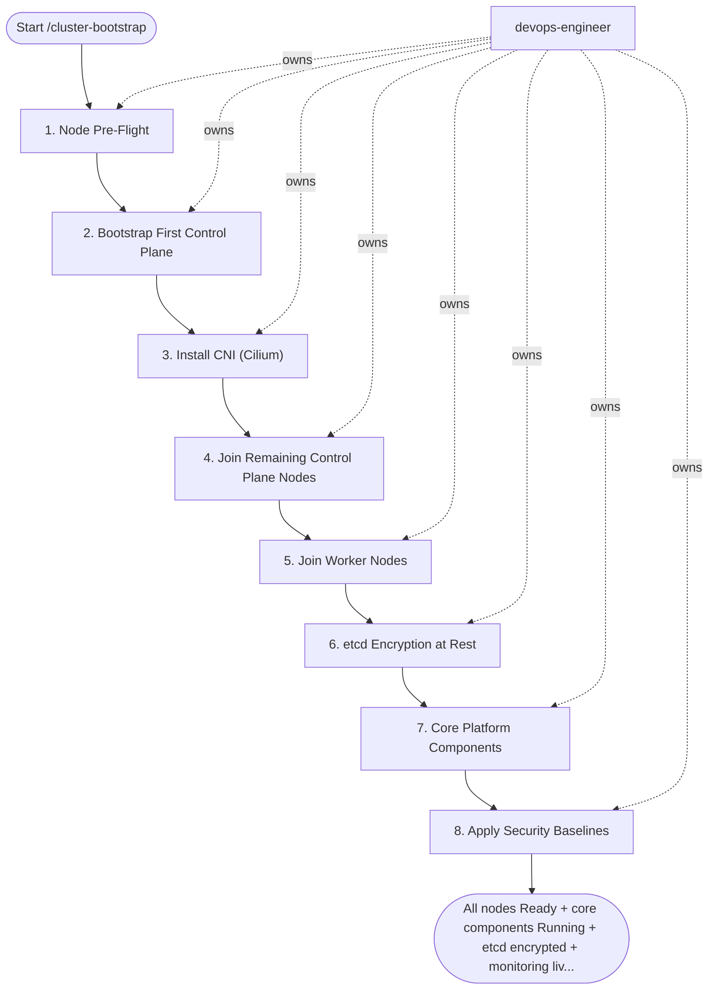

## Steps

### 1. Node Pre-Flight — `@devops-engineer`
- **Input:** node_inventory, cluster_name, pod_cidr, service_cidr from trigger inputs
- **Actions (all nodes via Ansible or manual):**
  - Confirm requirements BEFORE installing: cluster size (node count/roles), Kubernetes version, network CIDRs (no overlap with existing networks), and security baseline sign-off from `@team-lead`
  ```bash
  # Disable swap (K8s requirement)
  swapoff -a && sed -i '/swap/d' /etc/fstab

  # Load required kernel modules
  printf 'overlay\nbr_netfilter\n' > /etc/modules-load.d/k8s.conf
  modprobe overlay && modprobe br_netfilter

  # Kernel parameters
  cat > /etc/sysctl.d/k8s.conf << EOF
  net.bridge.bridge-nf-call-iptables  = 1
  net.bridge.bridge-nf-call-ip6tables = 1
  net.ipv4.ip_forward                 = 1
  EOF
  sysctl --system

  # Install containerd; enable SystemdCgroup
  apt-get install -y containerd
  mkdir -p /etc/containerd
  containerd config default > /etc/containerd/config.toml
  sed -i 's/SystemdCgroup = false/SystemdCgroup = true/' /etc/containerd/config.toml
  systemctl restart containerd

  # Install kubeadm, kubelet, kubectl (pin version)
  apt-get install -y kubeadm=1.31.* kubelet=1.31.* kubectl=1.31.*
  apt-mark hold kubeadm kubelet kubectl
  ```
- **Done when:** all nodes pass `kubeadm init phase preflight`

### 2. Bootstrap First Control Plane — `@devops-engineer`
- **Input:** cluster_name, pod_cidr, service_cidr, VIP for HA (keepalived/haproxy)
- **Actions:**
  ```bash
  # kubeadm config file (preferred over flags)
  cat > kubeadm-config.yaml << EOF
  apiVersion: kubeadm.k8s.io/v1beta3
  kind: ClusterConfiguration
  clusterName: ${CLUSTER_NAME}
  controlPlaneEndpoint: "${VIP}:6443"   # HA VIP
  networking:
    podSubnet: "${POD_CIDR}"            # e.g. 10.244.0.0/16
    serviceSubnet: "${SVC_CIDR}"        # e.g. 10.96.0.0/12
  ---
  apiVersion: kubeadm.k8s.io/v1beta3
  kind: InitConfiguration
  nodeRegistration:
    criSocket: unix:///run/containerd/containerd.sock
  EOF

  kubeadm init --config kubeadm-config.yaml --upload-certs

  # Configure kubectl
  mkdir -p ~/.kube
  cp /etc/kubernetes/admin.conf ~/.kube/config
  ```
- **Done when:** `kubectl get nodes` shows first control plane node (NotReady — CNI not yet installed)

### 3. Install CNI (Cilium) — `@devops-engineer`
- **Input:** initialized control plane and kubeconfig from step 2
- **Actions:**
  ```bash
  # Install Cilium CLI
  cilium install \
    --set ipam.mode=kubernetes \
    --set kubeProxyReplacement=true \
    --set hubble.enabled=true \
    --set hubble.relay.enabled=true \
    --set hubble.ui.enabled=true

  # Verify
  cilium status --wait
  ```
- If `cilium status` reports failures: check kernel modules and node connectivity; maximum 3 iterations, then stop and escalate to `@team-lead` with the open blocker list
- **Done when:** `kubectl get nodes` shows control plane `Ready`; `cilium status` shows OK

### 4. Join Remaining Control Plane Nodes — `@devops-engineer`
- **Input:** control-plane join command (token, CA hash, certificate key) from step 2 output
- **Actions (on each additional CP node):**
  ```bash
  # Use join command from `kubeadm init` output (includes --control-plane --certificate-key)
  kubeadm join ${VIP}:6443 \
    --token <token> \
    --discovery-token-ca-cert-hash sha256:<hash> \
    --control-plane \
    --certificate-key <cert-key>
  ```
- **Done when:** `kubectl get nodes` shows 3 control plane nodes `Ready`

### 5. Join Worker Nodes — `@devops-engineer`
- **Input:** worker join command from step 2 output; HA control plane from step 4
- **Actions (on each worker):**
  ```bash
  kubeadm join ${VIP}:6443 \
    --token <token> \
    --discovery-token-ca-cert-hash sha256:<hash>
  ```
  - Label workers: `kubectl label node <n> node-role.kubernetes.io/worker= topology.kubernetes.io/zone=<zone>`
- **Done when:** all workers `Ready` in `kubectl get nodes`

### 6. etcd Encryption at Rest — `@devops-engineer`
- **Input:** fully joined cluster (all nodes Ready) from step 5
- **Actions:**
  ```bash
  # Create EncryptionConfiguration
  cat > /etc/kubernetes/enc/encryption-config.yaml << EOF
  apiVersion: apiserver.config.k8s.io/v1
  kind: EncryptionConfiguration
  resources:
    - resources: [secrets, configmaps]
      providers:
        - aescbc:
            keys:
              - name: key1
                secret: $(head -c 32 /dev/urandom | base64)
        - identity: {}
  EOF

  # Add to kube-apiserver static pod manifest:
  # --encryption-provider-config=/etc/kubernetes/enc/encryption-config.yaml

  # Re-encrypt all existing secrets
  kubectl get secrets -A -o json | kubectl replace -f -
  ```
- **Done when:** apiserver restarts with encryption config; secrets re-encrypted (etcd read shows `k8s:enc:aescbc` prefix)

### 7. Core Platform Components — `@devops-engineer`
- **Input:** encrypted, HA cluster from step 6
- **Install in order:**
  ```bash
  # MetalLB (bare-metal load balancer)
  helm upgrade --install metallb metallb/metallb -n metallb-system --create-namespace
  # Apply IPAddressPool with your bare-metal IP range

  # cert-manager
  helm upgrade --install cert-manager jetstack/cert-manager \
    -n cert-manager --create-namespace \
    --set installCRDs=true

  # NGINX Ingress Controller
  helm upgrade --install ingress-nginx ingress-nginx/ingress-nginx \
    -n ingress-nginx --create-namespace

  # ArgoCD
  helm upgrade --install argocd argo/argo-cd \
    -n argocd --create-namespace \
    -f infra/argocd/values.yaml

  # External Secrets Operator
  helm upgrade --install external-secrets external-secrets/external-secrets \
    -n external-secrets --create-namespace
  ```
- **Done when:** all component pods Running; MetalLB assigns an external IP to a test LoadBalancer Service

### 8. Apply Security Baselines — `@devops-engineer`
- **Input:** cluster with core platform components from step 7
- **Actions:**
  - Apply OPA/Gatekeeper or Kyverno policies from `infra/policies/`
  - Create default namespace deny-all NetworkPolicy template
  - Configure etcd backup CronJob
  - Set up `kube-prometheus-stack` for cluster monitoring
- **Output:** `docs/clusters/<name>-bootstrap-report.md` — cluster version, node IPs, installed components, kubeconfig location
- **Done when:** full cluster validation passes after baselines are applied — all nodes Ready, a smoke workload deploys successfully, and policies are enforced

## Agent Interaction Diagram

<!-- agent-diagram:start -->

<!-- agent-diagram:end -->

## Exit
All nodes Ready + core components Running + etcd encrypted + monitoring live = cluster bootstrapped.

**Next:** /onboard-service — deploy the first workloads onto the bootstrapped cluster.
