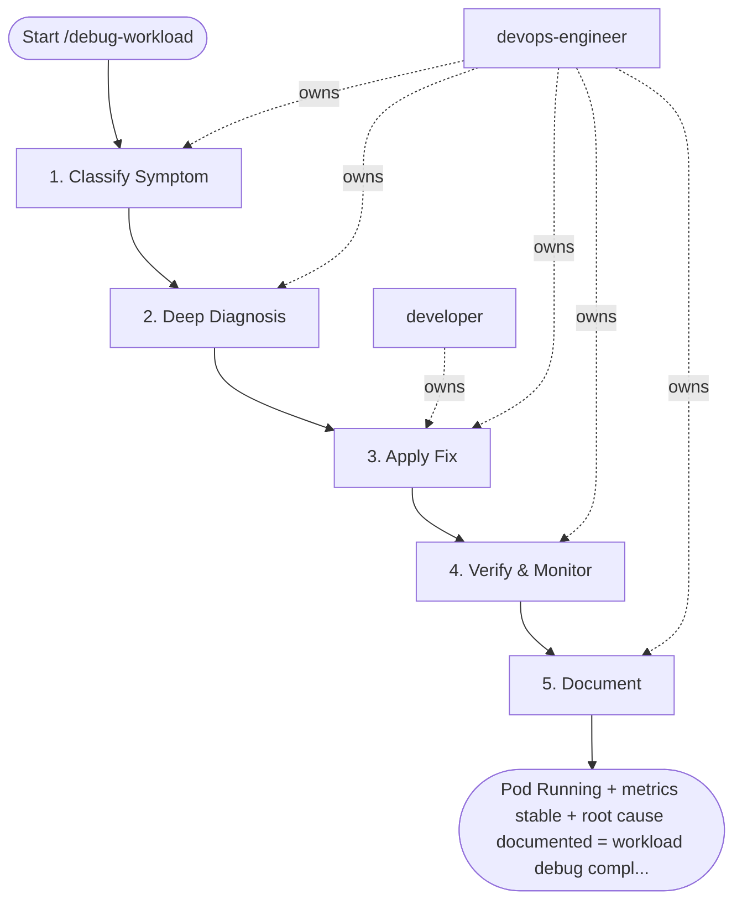

## Steps

### 1. Classify Symptom — `@devops-engineer`
- **Input:** workload name, namespace, symptom description
- **Actions:**
  - `kubectl get pods -n <ns> -l app=<name> -o wide` — check pod statuses
  - Classify into: Scheduling issue / Runtime crash / OOM / ImagePull / Service unreachable
  - Check recent events: `kubectl get events -n <ns> --sort-by='.lastTimestamp' | tail -20`
- **Output:** symptom classification (one of the above categories)
- **Done when:** root failure mode identified at pod level

### 2. Deep Diagnosis — `@devops-engineer`
- **Input:** symptom classification
- **Actions by category:**

  **CrashLoopBackOff:**
  ```bash
  kubectl logs <pod> -n <ns> --previous --tail=200
  kubectl describe pod <pod> -n <ns> | grep -A3 "Last State:"
  # Exit 137 = OOMKilled → raise memory limit
  # Exit 1 = app error → read logs
  # Exit 143 = SIGTERM → fix graceful shutdown
  ```

  **Pending:**
  ```bash
  kubectl describe pod <pod> -n <ns> | grep -A20 "Events:"
  kubectl describe nodes | grep -A5 "Allocated resources:"
  kubectl get nodes --show-labels | grep -v NotReady
  ```

  **ImagePullBackOff:**
  ```bash
  kubectl describe pod <pod> -n <ns> | grep -A5 "Failed to pull"
  kubectl get secret regcred -n <ns> -o yaml  # verify imagePullSecret
  ```

  **Service unreachable:**
  ```bash
  kubectl get endpoints <svc> -n <ns>   # empty = label selector mismatch
  kubectl describe svc <svc> -n <ns>    # check selector labels
  # Test DNS: kubectl run test --image=busybox -it --rm -- nslookup <svc>.<ns>
  ```

- **Output:** root cause identified with evidence
- **Done when:** can explain exactly why the workload failed

### 3. Apply Fix — `@developer` + `@devops-engineer`
- **Input:** root cause
- **Actions:**
  - Fix via Helm values / manifest change (never `kubectl edit` directly in production)
  - Commit change to Git; deploy via ArgoCD or CI pipeline
  - For P0/P1 only: `kubectl patch` as emergency measure + follow-up Git change within 1 hour
- **Output:** fixed manifest merged to Git + applied to cluster
- **Done when:** pods enter `Running` state; readiness probe passing

### 4. Verify & Monitor — `@devops-engineer`
- **Input:** deployed fix
- **Actions:**
  ```bash
  kubectl rollout status deployment/<name> -n <ns>
  kubectl get pods -n <ns> -l app=<name> -w   # watch for 2 minutes
  kubectl logs -n <ns> -l app=<name> --tail=50 # confirm no new errors
  ```
  - Check relevant Grafana dashboard for error rate and latency
- **Output:** workload healthy confirmation
- **Done when:** all pods `Running`, metrics normal, no log errors for 5 minutes

### 5. Document — `@devops-engineer`
- **Input:** root cause + fix applied
- **Actions:** write brief `root_cause_summary.md`:
  - What failed, why, which resource/manifest was at fault
  - Fix applied (link to commit)
  - Prevention: add to runbook? Add Prometheus alert? Change default values?
- **Output:** `docs/incidents/<date>-<workload>-root-cause.md`
- **Done when:** document committed; alert/runbook created if pattern is recurring

## Agent Interaction Diagram

<!-- agent-diagram:start -->

<!-- agent-diagram:end -->

## Exit
Pod Running + metrics stable + root cause documented = workload debug complete.
