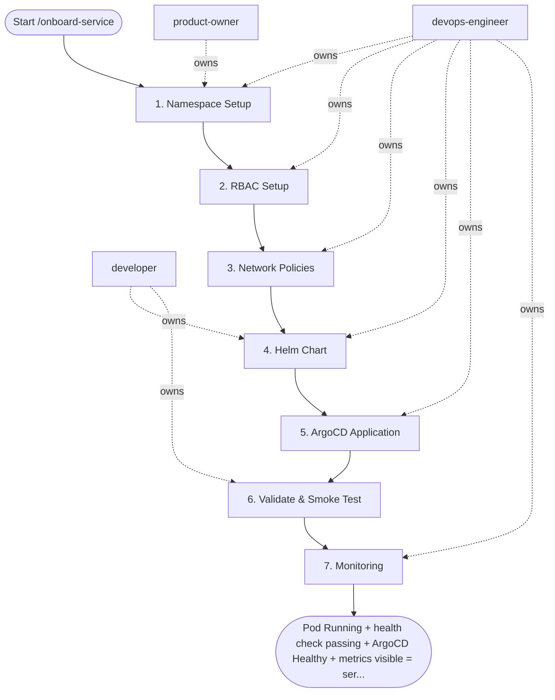

## Steps

1. Namespace Setup — `@product-owner` + `@devops-engineer`
- **Input:** service_name, team_name, environment
- **Actions:**
  ```bash
  # Create namespace with required labels
  kubectl create namespace ${SERVICE}-${ENV}
  kubectl label namespace ${SERVICE}-${ENV} \
    team=${TEAM} \
    environment=${ENV} \
    kubernetes.io/metadata.name=${SERVICE}-${ENV} \
    pod-security.kubernetes.io/enforce=restricted
  
  # Apply default LimitRange and ResourceQuota from team profile
  kubectl apply -f infra/namespaces/templates/${RESOURCE_PROFILE}/ \
    -n ${SERVICE}-${ENV}
  ```
- **Output:** namespace created with labels, LimitRange, ResourceQuota
- **Done when:** `kubectl get ns ${SERVICE}-${ENV}` shows Active

### 2. RBAC Setup — `@devops-engineer`
- **Input:** service_name, team_name
- **Actions:**
  - Create dedicated ServiceAccount for the workload
  - Create Role with minimum permissions (ConfigMap read, own Secret read)
  - Create RoleBinding
  - Create developer RoleBinding (group → `edit` ClusterRole in namespace)
  - Create CI/CD RoleBinding (ci-deployer ClusterRole → namespace)
- **Output:** ServiceAccount + Role + RoleBindings committed to `infra/rbac/` and applied
- **Done when:** `kubectl auth can-i list pods --as=system:serviceaccount:${NS}:${SA}` returns yes

### 3. Network Policies — `@devops-engineer`
- **Input:** service dependencies (which services it calls / which call it)
- **Actions:**
  - Apply default-deny-all + allow-dns templates
  - For each upstream dependency: add egress policy to target namespace:port
  - For each downstream caller: add ingress policy from source namespace
  - Add Prometheus scrape allow policy
- **Output:** NetworkPolicy manifests in `infra/netpol/${SERVICE}/` applied
- **Done when:** `kubectl get networkpolicy -n ${NS}` shows all 3+ policies

### 4. Helm Chart — `@developer` + `@devops-engineer`
- **Input:** service container image, port, health endpoints, env vars
- **Actions:**
  - Scaffold chart: `helm create charts/${SERVICE}`
  - Update `values.yaml` with resource profile defaults
  - Add security context (runAsNonRoot, readOnlyRootFilesystem, drop ALL caps)
  - Add HPA, PDB manifests
  - Add Ingress if service is externally exposed
  - Run: `helm lint charts/${SERVICE}/ -f values-${ENV}.yaml`
  - Run: `helm template ... | kubectl apply --dry-run=server -f -`
- **Output:** chart in `charts/${SERVICE}/` with passing lint and dry-run
- **Done when:** zero lint warnings; dry-run applies cleanly

### 5. ArgoCD Application — `@devops-engineer`
- **Input:** chart path, namespace, environment
- **Actions:**
  - Create `argocd/apps/${SERVICE}-${ENV}.yaml` Application manifest
  - Set `automated.prune=true`, `automated.selfHeal=true`
  - Set `syncPolicy.syncOptions: ServerSideApply=true`
  - Commit and push; ArgoCD auto-syncs
- **Output:** ArgoCD Application showing Synced + Healthy
- **Done when:** ArgoCD UI shows green; pod Running in cluster

### 6. Validate & Smoke Test — `@developer`
- **Input:** running service
- **Actions:**
  ```bash
  kubectl rollout status deployment/${SERVICE} -n ${NS}
  kubectl get pods -n ${NS} -l app=${SERVICE}
  # Health check
  kubectl port-forward svc/${SERVICE} 8080:8080 -n ${NS} &
  curl -f http://localhost:8080/health
  ```
- **Output:** service health endpoint returns 200
- **Done when:** health check passes; no pod restarts in 5 minutes

### 7. Monitoring — `@devops-engineer`
- **Input:** running service
- **Actions:**
  - Add `ServiceMonitor` for Prometheus scraping
  - Import standard dashboard from `infra/dashboards/service-overview.json` into Grafana
  - Set up basic alerts: HighErrorRate, HighLatency, PodRestarting
- **Output:** metrics visible in Grafana; alerts configured
- **Done when:** Grafana dashboard shows service metrics

## Agent Interaction Diagram

<!-- agent-diagram:start -->

<!-- agent-diagram:end -->

## Exit
Pod Running + health check passing + ArgoCD Healthy + metrics visible = service onboarded.
