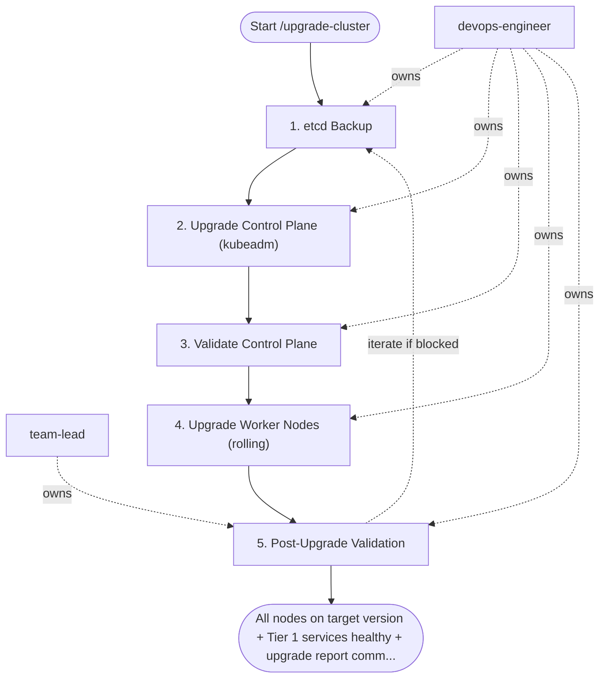

## Pre-Upgrade Checklist — `@devops-engineer` (1–2 days before)

```bash
# 1. Audit deprecated APIs (kubent = kube-no-trouble)
kubent --target-version <target>

# 2. Check component compatibility matrix
# Verify: ArgoCD, Cert-Manager, Ingress Controller, Prometheus Operator
# support target K8s version — check each project's release notes

# 3. Verify all nodes are Ready and no pending workloads
kubectl get nodes
kubectl get pods -A | grep -v Running | grep -v Completed

# 4. Check PodDisruptionBudgets won't block drain
kubectl get pdb -A

# 5. Review CHANGELOG for breaking changes between versions
# https://kubernetes.io/releases/
```

## Steps

### 1. etcd Backup — `@devops-engineer`
- **Input:** cluster_name, target_version
- **Actions:**
  ```bash
  ETCDCTL_API=3 etcdctl snapshot save \
    /backup/etcd-pre-upgrade-$(date +%Y%m%d-%H%M%S).db \
    --endpoints=https://127.0.0.1:2379 \
    --cacert=/etc/kubernetes/pki/etcd/ca.crt \
    --cert=/etc/kubernetes/pki/etcd/healthcheck-client.crt \
    --key=/etc/kubernetes/pki/etcd/healthcheck-client.key
  
  # Verify backup integrity
  ETCDCTL_API=3 etcdctl snapshot status /backup/etcd-pre-upgrade-*.db \
    --write-out=table
  ```
- **Done when:** backup file exists, status shows correct revision and hash

### 2. Upgrade Control Plane (kubeadm) — `@devops-engineer`
- **Input:** target_version
- **Actions (on first control plane node):**
  ```bash
  # Update kubeadm
  apt-get update && apt-get install -y kubeadm=<target>

  # Dry-run first
  kubeadm upgrade plan
  kubeadm upgrade apply v<target> --dry-run

  # Apply upgrade
  kubeadm upgrade apply v<target>

  # Upgrade kubelet and kubectl on control plane node
  apt-get install -y kubelet=<target> kubectl=<target>
  systemctl daemon-reload && systemctl restart kubelet
  ```
- **Actions (remaining control plane nodes):**
  ```bash
  kubeadm upgrade node   # (not apply — only 'node' for additional CP nodes)
  apt-get install -y kubelet=<target> kubectl=<target>
  systemctl daemon-reload && systemctl restart kubelet
  ```
- **Done when:** `kubectl version` shows new server version; all CP pods Running

### 3. Validate Control Plane — `@devops-engineer`
- **Input:** upgraded control plane
- **Actions:**
  ```bash
  kubectl get nodes          # CP nodes show new version
  kubectl get pods -n kube-system
  kubectl get cs             # componentstatuses
  # Run a quick API smoke test
  kubectl run test --image=nginx --restart=Never -n default
  kubectl delete pod test -n default
  ```
- **Done when:** all system pods Running; API server responsive

### 4. Upgrade Worker Nodes (rolling) — `@devops-engineer`
- **Input:** validated control plane
- **Actions (for each worker node, one at a time):**
  ```bash
  # Cordon + drain
  kubectl cordon <node>
  kubectl drain <node> \
    --ignore-daemonsets \
    --delete-emptydir-data \
    --grace-period=60 \
    --timeout=300s
  
  # Upgrade node (run on the node itself)
  apt-get update && apt-get install -y kubeadm=<target>
  kubeadm upgrade node
  apt-get install -y kubelet=<target> kubectl=<target>
  systemctl daemon-reload && systemctl restart kubelet
  
  # Return to service
  kubectl uncordon <node>
  
  # Wait for node Ready + all pods rescheduled before next node
  kubectl wait --for=condition=Ready node/<node> --timeout=5m
  sleep 60   # let pods stabilise
  ```
- **Done when:** all nodes show new version in `kubectl get nodes`

### 5. Post-Upgrade Validation — `@devops-engineer` + `@team-lead`
- **Input:** fully upgraded node pool from step 4.
- **Actions:**
  ```bash
  kubectl get nodes -o wide
  kubectl get pods -A | grep -v Running | grep -v Completed
  kubectl top nodes
  ```
  - Run smoke tests against all Tier 1 services
  - Verify ArgoCD, Cert-Manager, Prometheus Operator pods healthy
  - Check monitoring dashboards for anomalies
- **Output:** upgrade report at `docs/upgrades/<cluster>-<version>-upgrade-report.md` — versions before/after, issues found, time taken
- **Done when:** all Tier 1 services healthy; no unexpected pod restarts

## Agent Interaction Diagram

<!-- agent-diagram:start -->

<!-- agent-diagram:end -->

## Rollback Plan

```bash
# Control plane rollback (if upgrade apply fails — only within same session)
kubeadm upgrade apply v<previous-version>

# Full disaster recovery (if cluster is broken)
# 1. Stop kube-apiserver
# 2. Restore etcd from backup:
ETCDCTL_API=3 etcdctl snapshot restore /backup/etcd-pre-upgrade.db \
  --data-dir=/var/lib/etcd-restored
# 3. Update etcd static pod manifest to new data-dir
# 4. Restart control plane
```

- At most one rollback-and-retry cycle per maintenance window; a second post-upgrade validation failure freezes the upgrade and escalates to `@team-lead`.

## Exit
All nodes on target version + Tier 1 services healthy + upgrade report committed = upgrade complete.

**Next:** terminal — no follow-up workflow.
