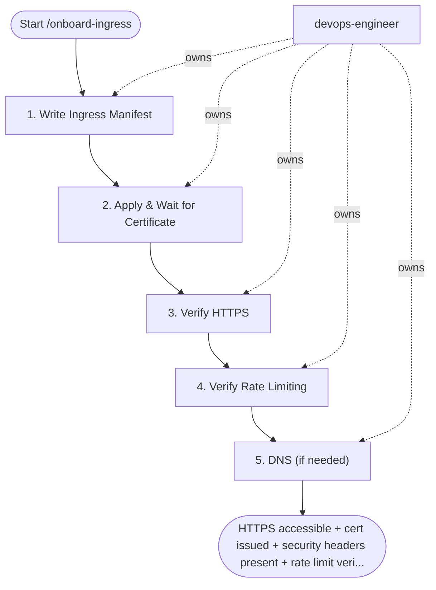

## Steps

### 1. Write Ingress Manifest — `@devops-engineer`
- **Input:** service_name, hostname, tls_source from trigger inputs
- Include all mandatory annotations (ssl-redirect, rate-limit, security headers, timeouts)
- Set cert-manager annotation matching chosen issuer
- **Done when:** `kubectl apply --dry-run=server` passes

### 2. Apply & Wait for Certificate — `@devops-engineer`
- **Input:** validated ingress manifest from step 1
```bash
kubectl apply -f ingress.yaml
# Watch certificate issuance (Let's Encrypt: up to 2 min; internal CA: < 30s)
kubectl get certificate -n <ns> -w
kubectl describe certificate <cert-name> -n <ns>   # check events if stuck
```
- If certificate issuance fails: do NOT flip DNS; fix the issuer/challenge configuration and re-issue; maximum 2 attempts, then stop and escalate to `@team-lead`
- **Done when:** certificate `Ready=True` (issued, not pending)

### 3. Verify HTTPS — `@devops-engineer`
- **Input:** issued certificate from step 2
```bash
curl -v https://<hostname>/health
# Check: TLS version, cipher, cert expiry, HSTS header
```
- **Done when:** HTTPS returns 200; TLS version/cipher meet policy; HSTS header present

### 4. Verify Rate Limiting — `@devops-engineer`
- **Input:** HTTPS-verified endpoint from step 3
```bash
# Quick rate limit test (expect 429 after N requests)
for i in $(seq 1 200); do
  curl -s -o /dev/null -w "%{http_code}\n" https://<hostname>/health
done | sort | uniq -c
```
- **Done when:** 429 responses observed once the limit is exceeded

### 5. DNS (if needed) — `@devops-engineer`
- **Input:** verified ingress (HTTPS + rate limit) from steps 3–4; MetalLB external IP
- Point hostname to MetalLB external IP: `kubectl get svc -n ingress-nginx`
- Add A record in DNS provider or internal CoreDNS
- Verify DNS propagation against the record TTL: `dig <hostname>` from at least 2 resolvers returns the new IP
- Confirm HTTPS end-to-end on the public hostname before declaring success: `curl -v https://<hostname>/health`
- Record the ingress config in `docs/networking/ingress-<service>.md`
- **Done when:** DNS propagated on ≥2 resolvers within TTL expectations; public HTTPS check passes; ingress recorded in `docs/networking/ingress-<service>.md`

## Agent Interaction Diagram

<!-- agent-diagram:start -->

<!-- agent-diagram:end -->

## Exit
HTTPS accessible + cert issued + security headers present + rate limit verified = ingress onboarded.

**Next:** terminal — no follow-up workflow.
