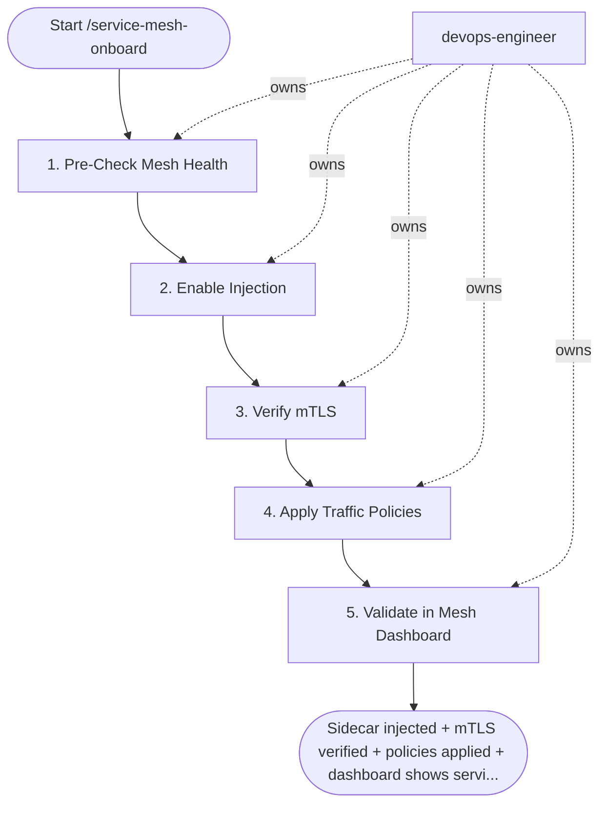

## Steps

### 1. Pre-Check Mesh Health — `@devops-engineer`
- **Input:** service_name, namespace, mesh from trigger inputs
```bash
# Linkerd
linkerd check
linkerd viz stat ns/default   # verify mesh is processing traffic

# Istio
istioctl check-inject -n ${NAMESPACE}
istioctl analyze -n ${NAMESPACE}
```
- **Done when:** mesh healthy with no data plane issues

### 2. Enable Injection — `@devops-engineer`
- **Input:** mesh health confirmation from step 1
```bash
# Linkerd: annotate namespace (all new pods get sidecar)
kubectl annotate namespace ${NAMESPACE} linkerd.io/inject=enabled

# Istio: label namespace
kubectl label namespace ${NAMESPACE} istio-injection=enabled

# Restart pods to inject sidecar into existing pods
kubectl rollout restart deployment/${SERVICE} -n ${NAMESPACE}
```
- **Done when:** `kubectl get pods -n ${NAMESPACE}` shows 2/2 (or 3/3 for Istio) containers

### 3. Verify mTLS — `@devops-engineer`
- **Input:** sidecar-injected pods from step 2
```bash
# Linkerd: check edges (shows whether traffic is mTLS)
linkerd viz edges deployment/${SERVICE} -n ${NAMESPACE}
# Look for: SECURED column = true

linkerd viz tap deployment/${SERVICE} -n ${NAMESPACE} \
  | grep -E "tls|secure"

# Istio: verify PeerAuthentication is enforced
kubectl get peerauthentication -n ${NAMESPACE}
# If no PeerAuthentication: all traffic still accepted (PERMISSIVE)
# Apply STRICT mode after all services in namespace are meshed:
kubectl apply -f - << 'YAML'
apiVersion: security.istio.io/v1beta1
kind: PeerAuthentication
metadata:
  name: default
  namespace: ${NAMESPACE}
spec:
  mtls:
    mode: STRICT
YAML
```
- If mTLS enforcement breaks live traffic: roll back the injection label immediately, re-test in permissive mode; maximum 1 retry of enforcement, then stop and escalate to `@team-lead`
- **Done when:** `linkerd viz edges` shows SECURED=true or Istio PeerAuthentication=STRICT

### 4. Apply Traffic Policies — `@devops-engineer`
- **Input:** mTLS-verified service from step 3
```bash
# Linkerd ServiceProfile: retries + timeouts
kubectl apply -f - << 'YAML'
apiVersion: linkerd.io/v1alpha2
kind: ServiceProfile
metadata:
  name: ${SERVICE}.${NAMESPACE}.svc.cluster.local
  namespace: ${NAMESPACE}
spec:
  routes:
    - name: POST /api/orders
      condition:
        method: POST
        pathRegex: /api/orders
      timeout: 10s
      retryBudget:
        retryRatio: 0.2
        minRetriesPerSecond: 5
        ttl: 10s
YAML
```
- **Done when:** ServiceProfile/policy applied; retry and timeout behavior visible in mesh route metrics

### 5. Validate in Mesh Dashboard — `@devops-engineer`
- **Input:** applied traffic policies from step 4
```bash
# Linkerd: open viz dashboard
linkerd viz dashboard &

# Check for:
# - Success rate > 99% on meshed routes
# - Latency histograms visible
# - No "naked" (unmeshed) traffic sources reaching the service

# Istio: check Kiali or Grafana Istio dashboards
kubectl -n istio-system port-forward svc/kiali 20001:20001 &
```
- Record mesh onboarding in `docs/networking/mesh-<service>.md` (mesh, mTLS mode, policies applied)
- **Done when:** service visible in mesh dashboard; no unmeshed traffic warnings; onboarding recorded in `docs/networking/mesh-<service>.md`

## Agent Interaction Diagram

<!-- agent-diagram:start -->

<!-- agent-diagram:end -->

## Exit
Sidecar injected + mTLS verified + policies applied + dashboard shows service = onboarded.

**Next:** terminal — no follow-up workflow.
