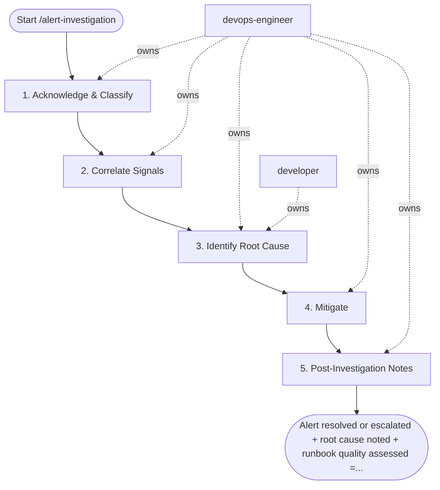

## Steps

### 1. Acknowledge & Classify — `@devops-engineer`
- **Input:** alert_name, alert_labels, firing_since from trigger inputs
- Open Grafana: navigate to service dashboard for the affected service
- Check: is this a real user-impact alert or a false positive?
  - Real: error rate / latency / saturation affecting users
  - False: alert threshold too sensitive for normal traffic patterns
- Check: when did the alert start? Correlate with recent deploys or cron jobs
- **Done when:** alert classified (real/false-positive) and current status known

### 2. Correlate Signals — `@devops-engineer`
- **Input:** classified alert (real/false-positive) from step 1

**Metrics (Prometheus):**
```promql
-- Error rate breakdown by endpoint
sum(rate(http_requests_total{service="$svc", status=~"5.."}[5m])) by (path)
/ sum(rate(http_requests_total{service="$svc"}[5m])) by (path)

-- Latency distribution shift
histogram_quantile(0.99, sum(rate(http_request_duration_seconds_bucket{service="$svc"}[5m])) by (le))

-- Recent pod restarts
increase(kube_pod_container_status_restarts_total{namespace="$ns"}[30m])
```

**Logs (Loki):**
```logql
{namespace="$ns", app="$svc"} | json | level="error"
  | line_format "{{.message}} trace={{.trace_id}}"
```

**Traces (Tempo):**
- Search by trace_id from logs → view full request trace
- Filter by `duration > 1s AND status=error` to find slow/failing requests

- **Done when:** correlated evidence (metrics, logs, traces) collected for the firing window

### 3. Identify Root Cause — `@devops-engineer` + `@developer`
- **Input:** correlated signal evidence from step 2

Decision tree:
```
Error rate spike?
  → Recent deploy? → Check image diff, config changes → Rollback candidate
  → No deploy? → Check upstream dependency health, DB connections, external API

Latency spike?
  → CPU throttling? → Check container_cpu_throttled_seconds
  → Memory pressure? → Check working set vs limits
  → Downstream slow? → Trace to identify bottleneck service
  → DB slow? → Check pg_stat_statements, lock waits

Saturation?
  → CPU: scale out or increase limits
  → Memory: right-size or find leak
  → Connections: check PgBouncer, connection leak
```

- **Done when:** root cause identified (or narrowed to a rollback/scale decision) before any silence is applied

### 4. Mitigate — `@devops-engineer`
- **Input:** root cause from step 3
- Apply fix (rollback, scale, restart, config change)
- Watch: is the alert resolving? (usually auto-resolves within `for:` duration after fix)
- If not resolving: trigger /incident-response (at most one automatic trigger; if the condition recurs, stop and escalate to a human decision)
- **Done when:** alert resolved, or /incident-response triggered

### 5. Post-Investigation Notes — `@devops-engineer`
- **Input:** mitigation outcome from step 4
- Was the runbook adequate? (could a junior follow it to resolution?)
- Is the alert threshold correct? (too sensitive = toil; too loose = misses real issues)
- Create ticket if: runbook needs update, threshold needs tuning, or root cause needs a code fix
- For P1-class alerts: write `docs/incidents/<date>-<alert>-root-cause.md`
- Always update the service runbook if the alert was actionable
- **Done when:** notes recorded; P1 root-cause doc written when applicable; runbook updated if the alert was actionable

## Agent Interaction Diagram

<!-- agent-diagram:start -->

<!-- agent-diagram:end -->

## Exit
Alert resolved or escalated + root cause noted + runbook quality assessed = investigation complete.

**Next:** /incident-response when escalated in step 4; otherwise terminal — no follow-up workflow.
