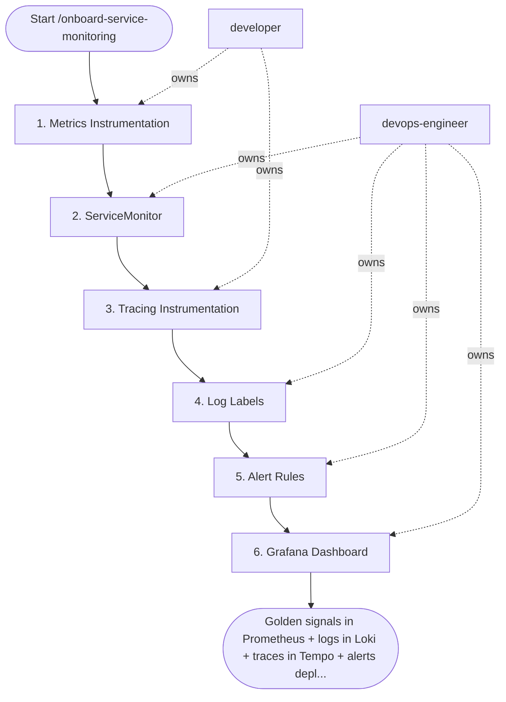

## Steps

### 1. Metrics Instrumentation — `@developer`
- Add Prometheus client library to service
- Expose standard HTTP metrics (requests_total, duration histogram, active_requests)
- Expose `/metrics` endpoint on port 9090 (or sidecar annotation)
- **Done when:** `curl http://<pod-ip>:9090/metrics` returns Prometheus format

### 2. ServiceMonitor — `@devops-engineer`
```yaml
apiVersion: monitoring.coreos.com/v1
kind: ServiceMonitor
metadata:
  name: ${SERVICE}
  namespace: ${NAMESPACE}
spec:
  selector:
    matchLabels: { app: ${SERVICE} }
  endpoints:
    - port: metrics
      interval: 15s
      path: /metrics
```
- **Done when:** Prometheus targets page shows service as UP

### 3. Tracing Instrumentation — `@developer`
- Add OpenTelemetry SDK (or use K8s operator auto-injection)
- Configure OTLP exporter → otel-collector:4317
- Verify trace_id appears in application logs
- **Done when:** traces visible in Tempo; trace_id in logs

### 4. Log Labels — `@devops-engineer`
- Verify Promtail/Fluent Bit picks up pod logs
- Confirm JSON parsing works: `{namespace="${NS}", app="${SERVICE}"} | json`
- Add log-based alert if service emits structured error logs
- **Done when:** logs searchable in Loki with level + trace_id fields

### 5. Alert Rules — `@devops-engineer`
- Create `PrometheusRule` with golden signal alerts (HighErrorRate, HighP99Latency, PodMemoryPressure)
- Write runbook for each alert in `docs/runbooks/`
- Test alert firing: temporarily lower threshold, verify Alertmanager receives it
- **Done when:** all alerts show in Prometheus rules page; test fire works

### 6. Grafana Dashboard — `@devops-engineer`
- Import standard service overview dashboard template
- Customize: add service-specific panels (queue depth, custom business metrics)
- Link trace panel (Tempo datasource) to request duration panel
- **Done when:** dashboard saved in `infra/dashboards/`; Grafana shows live data

## Agent Interaction Diagram

<!-- agent-diagram:start -->

<!-- agent-diagram:end -->

## Exit
Golden signals in Prometheus + logs in Loki + traces in Tempo + alerts deployed + dashboard live = service monitored.
