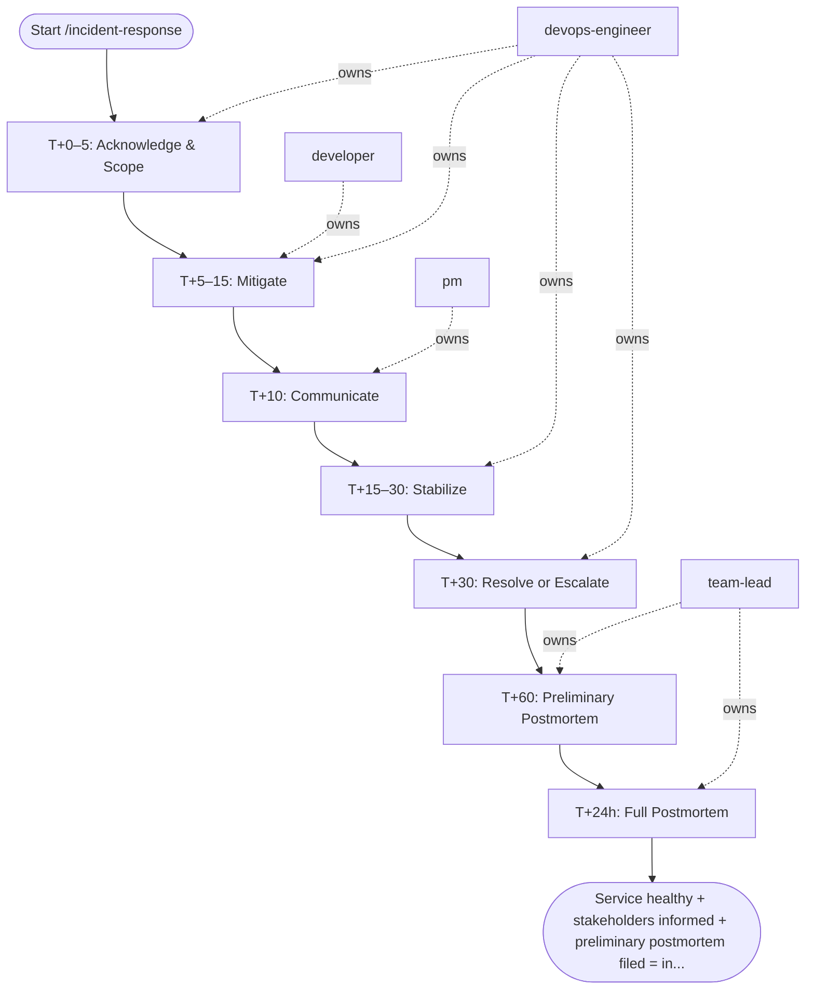

## Steps

Role assignments: `@devops-engineer` is incident commander (IC), `@developer` is technical lead, `@pm` owns comms.

### T+0–5: Acknowledge & Scope — `@devops-engineer`
- **Input:** incident_summary, severity, and affected_service from the workflow inputs.
- Post to #incidents: "I'm on this. War room: [link]"
- Scope: `kubectl get pods -A | grep -v Running`; check Grafana golden signals
- Declare severity; page secondary if P0
- **Done when:** severity declared, war room open, and blast radius scoped.

### T+5–15: Mitigate — `@developer` + `@devops-engineer`
- **Input:** scoped incident and declared severity from T+0–5.
- **First: try rollback** — `helm rollback <release> -n <ns>`
- If rollback not applicable: feature flag off → scale up → restart
- Start scribe doc: copy timeline template, log every action with timestamp
- **Done when:** a runbook mitigation applied and its result recorded in the scribe doc.

### T+10: Communicate — `@pm`
- **Input:** declared severity and symptom summary from T+0–5.
- Status page update: "Investigating [symptom] affecting [service]"
- Stakeholder Slack message in #incidents + product channel
- **Done when:** status page updated within 10 min of P0 declaration and stakeholders notified.

### T+15–30: Stabilize — `@devops-engineer`
- **Input:** applied mitigation and scribe timeline from T+5–15.
- Watch error rate for 10 min post-mitigation
- Confirm P95 and P99 latency returning to baseline
- If not stabilized: work through the runbook mitigation list at most once end-to-end; if none stabilize, escalate to `@team-lead` to raise severity or engage the vendor
- **Done when:** error rate and P95/P99 latency back at baseline for 10 min, or escalation raised.

### T+30: Resolve or Escalate — `@devops-engineer`
- **Input:** stabilization result from T+15–30.
- If resolved: status page "Monitoring"; all-clear in #incidents
- If not: retry the current mitigation at most 3 times, then escalate to `@team-lead` for a severity raise
- **Done when:** incident resolved with all-clear posted, or severity raised with `@team-lead` engaged.

### T+60: Preliminary Postmortem — `@team-lead`
- **Input:** real-time scribe timeline from the incident.
- Create preliminary postmortem notes with timeline (while fresh) at `docs/incidents/<date>-<slug>-root-cause.md`
- Mark as Draft; schedule 5-whys session within 48h
- **Done when:** preliminary notes committed and 5-whys session scheduled.

### T+24h: Full Postmortem — `@team-lead`
- **Input:** preliminary postmortem notes from T+60.
- Trigger `/postmortem` with incident_id, severity, and timeline_raw (the preliminary postmortem notes) — at most one automatic trigger; if it fails, escalate to a human decision
- **Done when:** /postmortem triggered with the handoff inputs.

## Agent Interaction Diagram

<!-- agent-diagram:start -->

<!-- agent-diagram:end -->

## Exit
Service healthy + stakeholders informed + preliminary postmortem filed = incident closed.

**Next:** /postmortem — full RCA, action items, and publication.
