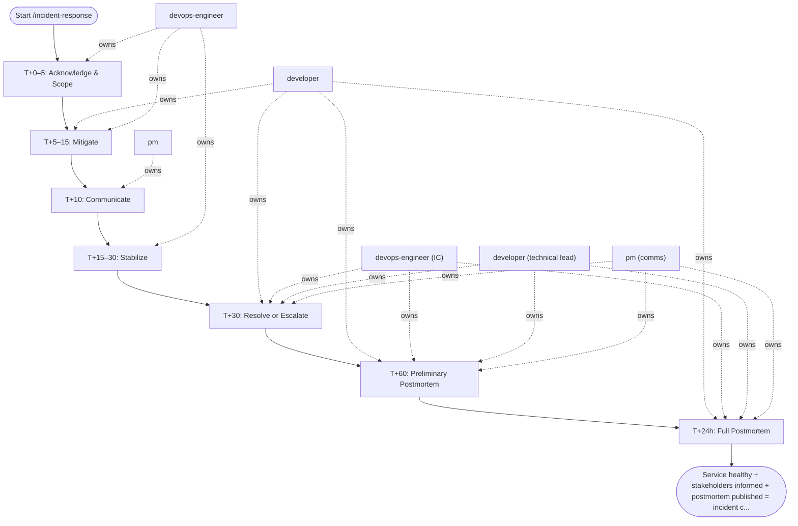

## Steps

### T+0–5: Acknowledge & Scope — `@devops-engineer`
- Post to #incidents: "I'm on this. War room: [link]"
- Scope: `kubectl get pods -A | grep -v Running`; check Grafana golden signals
- Declare severity; page secondary if P0

### T+5–15: Mitigate — `@developer` + `@devops-engineer`
- **First: try rollback** — `helm rollback <release> -n <ns>`
- If rollback not applicable: feature flag off → scale up → restart
- Start scribe doc: copy timeline template, log every action with timestamp

### T+10: Communicate — `@pm`
- Status page update: "Investigating [symptom] affecting [service]"
- Stakeholder Slack message in #incidents + product channel

### T+15–30: Stabilize — `@devops-engineer`
- Watch error rate for 10 min post-mitigation
- Confirm P95 and P99 latency returning to baseline
- If not stabilized: re-escalate; try next mitigation step

### T+30: Resolve or Escalate
- If resolved: status page "Monitoring"; all-clear in #incidents
- If not: loop mitigation; escalate to on-call lead

### T+60: Preliminary Postmortem
- Create postmortem doc with timeline (while fresh)
- Mark as Draft; schedule 5-whys session within 48h

### T+24h: Full Postmortem
- Complete 5-whys RCA
- Define action items with owners and due dates
- Publish to team wiki; announce in #postmortems

## Agent Interaction Diagram

<!-- agent-diagram:start -->

<!-- agent-diagram:end -->

## Exit
Service healthy + stakeholders informed + postmortem published = incident closed.
