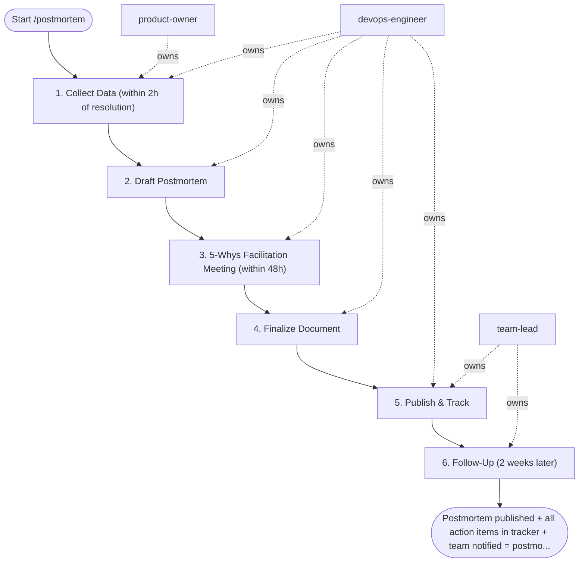

## Steps

1. Collect Data (within 2h of resolution) — `@product-owner` + `@devops-engineer`
- Export timeline from scribe doc / Slack thread
- Pull metrics from Prometheus: error rate, latency, pod events during incident window
- Download relevant log excerpts from Loki
- Note: who was involved, what actions were taken, what worked

### 2. Draft Postmortem — `@devops-engineer`
- Use `postmortem-analysis` skill template
- Write timeline with precise UTC timestamps
- Write preliminary 5-whys (iteration 1 — will be refined in meeting)
- List initial action item candidates
- Mark doc: **DRAFT — pending review meeting**

### 3. 5-Whys Facilitation Meeting (within 48h) — `@devops-engineer` (facilitator)

**Meeting format (45–60 min):**
```
5 min:  Ground rules — blameless; focus on systems, not people
10 min: Walk through timeline (verify accuracy, fill gaps)
20 min: 5-Whys analysis (stop when you reach a missing process/tooling/convention)
15 min: Action items — specific, owned, dated; challenge vague items
5 min:  What went well? (at least 3 items)
```

**Facilitation rules:**
- If the answer is "human error" → ask why the system allowed the error
- If the answer is "lack of monitoring" → that's an actionable system gap
- If a "why" repeats a previous incident → high priority to fix
- Stop at 5 whys or when you reach an organizational/process level

### 4. Finalize Document — `@devops-engineer`
- Incorporate all meeting feedback
- Ensure every action item:
  - Is specific (not "improve testing" but "add k6 load test for /checkout")
  - Has a named owner
  - Has a due date within 2–4 weeks
- Remove any blame language ("Alice forgot to" → "the process did not require")
- Calculate SLO impact: minutes of error budget consumed

### 5. Publish & Track — `@devops-engineer` + `@team-lead`
```bash
# Create Jira/Linear tickets for each action item
for item in action_items; do
  create_ticket --title "$item.title" --assignee "$item.owner" --due "$item.due_date" \
    --label "postmortem-followup" --link "postmortem_url"
done
```
- Publish to team wiki (Confluence/Notion)
- Announce in #postmortems Slack: "Postmortem for INC-XXXX published: [link]"
- Add to monthly reliability review agenda

### 6. Follow-Up (2 weeks later) — `@team-lead`
- Check ticket status: are action items progressing?
- Any blocked items? Need resource allocation?
- If root cause not addressed: escalate to engineering lead

## Agent Interaction Diagram

<!-- agent-diagram:start -->

<!-- agent-diagram:end -->

## Exit
Postmortem published + all action items in tracker + team notified = postmortem complete.
