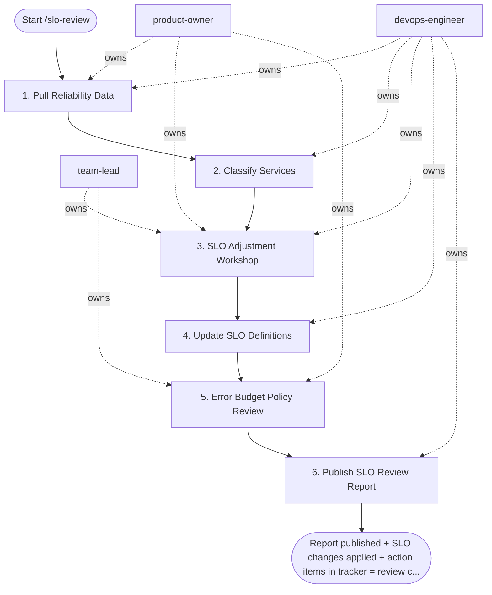

## Steps

1. Pull Reliability Data — `@product-owner` + `@devops-engineer`
```promql
-- 90-day availability per service
avg_over_time(
  slo:http_availability:ratio_rate5m{service="$svc"}[90d]
) * 100

-- Total error budget consumed this quarter
(
  1 - avg_over_time(
    slo:http_availability:ratio_rate5m{service="$svc"}[90d]
  )
) / (1 - 0.995) * 100   -- as % of total budget
```
- For each service: actual availability, error budget consumed, number of incidents

### 2. Classify Services — `@devops-engineer`

| Category | Criteria | Action |
|:---|:---|:---|
| **Overperforming** | Actual > SLO + 0.5% | Tighten SLO (stop "saving" budget by over-engineering) |
| **Meeting SLO** | Within ±0.2% | No change required |
| **Underperforming** | Budget < 25% remaining | Investigate root cause; adjust target or invest in reliability |
| **New service** | < 1 month of data | Set conservative target; review in 30 days |

### 3. SLO Adjustment Workshop — `@devops-engineer` + `@team-lead` + `@product-owner`

For each flagged service:
- **Tightening:** "We maintained 99.92% — can we commit to 99.9% and remove over-engineering?"
- **Loosening:** "We hit 99.3% but committed to 99.5% — is the gap a reliability problem or wrong target?"
- **New SLIs:** any new customer-visible behavior not yet covered by an SLI?

### 4. Update SLO Definitions — `@devops-engineer`
```yaml
# Update slo/<service>.yaml (Sloth)
# Re-generate Prometheus rules
sloth generate -i slo/${SERVICE}.yaml -o rules/slo-${SERVICE}-generated.yaml
kubectl apply -f rules/slo-${SERVICE}-generated.yaml -n monitoring
```

### 5. Error Budget Policy Review — `@team-lead` + `@product-owner`
- Did any service exhaust budget? → Was feature freeze enforced? Did it work?
- Any services that needed freeze but policy wasn't triggered? → Fix thresholds
- Review next quarter's reliability investment vs feature work ratio

### 6. Publish SLO Review Report — `@devops-engineer`
```markdown
# SLO Review Report — Q4 2024

| Service   | SLO Target | Actual Q4 | Budget Used | Action |
|:----------|:-----------|:----------|:------------|:-------|
| checkout  | 99.5%      | 99.71%    | 42%         | None   |
| payments  | 99.9%      | 99.82%    | 80%         | Invest |
| notify    | 99.0%      | 99.43%    | 0%          | Tighten to 99.3% |

## Decisions
- payments: allocate 20% of Q1 sprint capacity to reliability work
- notify: tighten SLO to 99.3%; generates meaningful error budget
```

## Agent Interaction Diagram

<!-- agent-diagram:start -->

<!-- agent-diagram:end -->

## Exit
Report published + SLO changes applied + action items in tracker = review complete.
