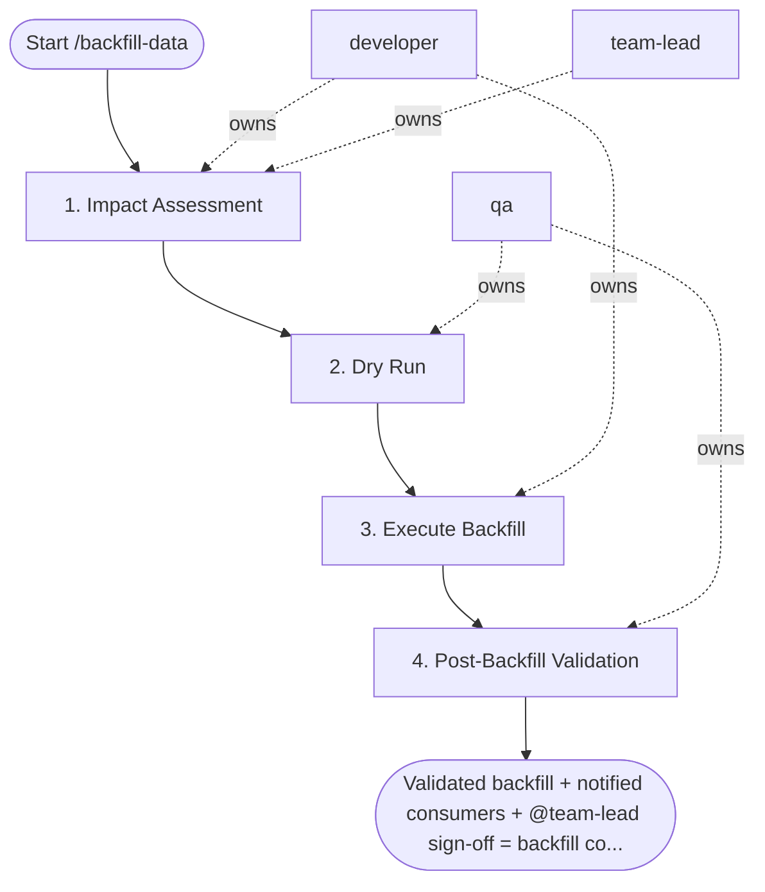

## Steps

### 1. Impact Assessment — `@developer` + `@team-lead`
- **Input:** model name, date range
- **Actions:** identify all downstream models depending on target; estimate row count and processing time; check if model consumed by real-time dashboards or SLA-critical flows; calculate optimal batch size to avoid OOM; estimate compute cost (Snowflake credits, BigQuery bytes)
- **Output:** impact assessment note with batch plan and cost estimate
- **Done when:** `@team-lead` approves plan (written approval recorded); cost within budget

### 2. Dry Run — `@qa`
- **Input:** approved batch plan
- **Actions:** run backfill on single-day partition first; compare row counts with source; check for duplicates on unique key
- **Output:** dry-run validation results
- **Done when:** single partition matches source with no duplicates

### 3. Execute Backfill — `@developer`
- **Input:** validated dry run
- **Actions:** run in off-peak hours; log progress every N batches; on failure: report which partition failed — do not retry blindly
  - small models: `dbt run --select <model> --full-refresh`
  - large ranges: chunked SQL with progress logging by month
- **Output:** backfill complete; progress log
- **Done when:** all partitions processed without errors

### 4. Post-Backfill Validation — `@qa`
- **Input:** backfilled model
- **Actions:** run dbt tests on backfilled model; compare key metrics before/after; verify no duplicates; notify downstream consumers that backfill is complete
- **Output:** `validation_report.md` — row counts, metric comparison, dbt test results
- **Done when:** all tests pass; metrics match expected; consumers notified

## Agent Interaction Diagram

<!-- agent-diagram:start -->

<!-- agent-diagram:end -->

## Exit
Validated backfill + notified consumers + `@team-lead` sign-off = backfill complete.

**Next:** terminal — no follow-up workflow.
