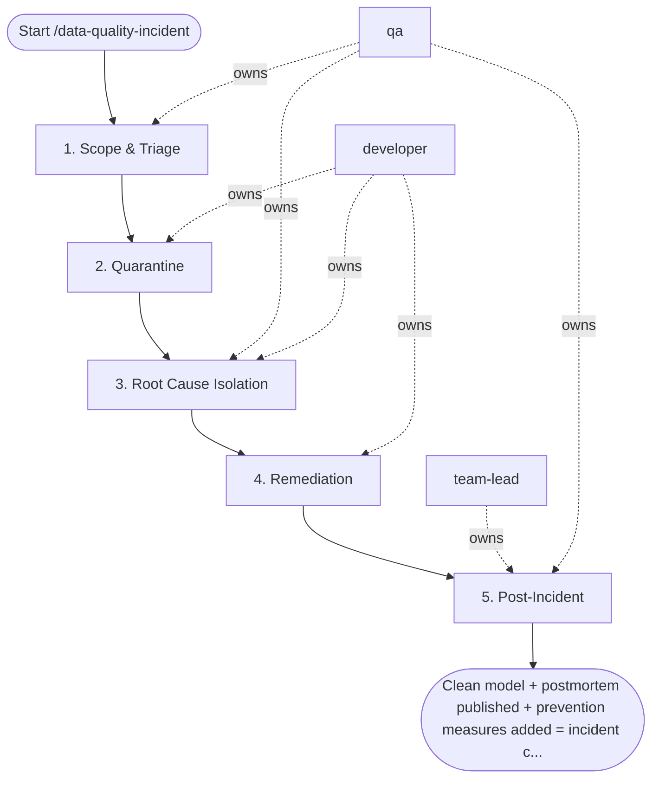

## Steps

### 1. Scope & Triage — `@qa`
- **Input:** incident alert or report
- **Actions:** check row count and freshness on affected model; compare to expected values from monitoring baselines; identify when anomaly started and which partitions are affected; classify type: duplicate / missing / wrong_values / sla_breach
- **Output:** incident scope note — affected partitions, anomaly window, classification
- **Done when:** scope confirmed; `@team-lead` briefed

### 2. Quarantine — `@developer`
- **Input:** affected partitions list
- **Actions:** tag affected partitions as `data_quality=SUSPECT`; alert downstream consumers (BI, ML teams) to not use affected data
- **Output:** quarantine applied; consumers notified
- **Done when:** affected data marked; no new consumers reading suspect partitions

### 3. Root Cause Isolation — `@qa` + `@developer`
- **Input:** quarantined incident
- **Actions:** check in order — (a) source data: correct in raw? compare raw vs. staged; (b) pipeline logic: recent code changes? `git log`; (c) schema change: upstream registry diff; (d) infrastructure: warehouse outage or partial run
- **Output:** root cause identified and documented
- **Done when:** single root cause confirmed; not multiple competing hypotheses

### 4. Remediation — `@developer`
- **Input:** confirmed root cause
- **Actions:** fix root cause in pipeline code; re-run pipeline via `/backfill-data` for affected window; lift quarantine tag after validation passes
- **Output:** remediated model; quarantine lifted
- **Done when:** `/backfill-data` validation passes; model clean

### 5. Post-Incident — `@team-lead` + `@qa`
- **Input:** remediated incident
- **Actions:** add monitoring rule to catch this pattern earlier; update dbt tests to prevent regression; write postmortem: `.data/incidents/<date>-<model>-incident.md`
- **Output:** postmortem; monitoring updated; dbt tests updated
- **Done when:** postmortem reviewed; prevention measures in place

## Agent Interaction Diagram

<!-- agent-diagram:start -->

<!-- agent-diagram:end -->

## Exit
Clean model + postmortem published + prevention measures added = incident closed.
