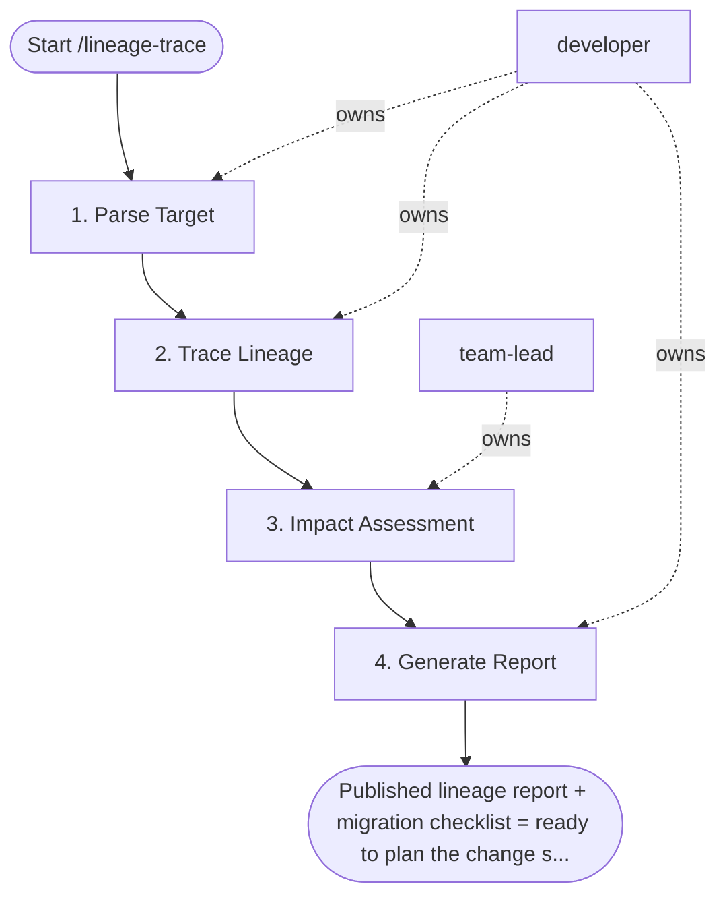

## Steps

### 1. Parse Target — `@developer`
- **Input:** target column or table, direction (upstream / downstream / both)
- **Actions:** identify table and optional column in warehouse catalog; load dbt `manifest.json` for lineage graph
- **Output:** confirmed target node in lineage graph
- **Done when:** target resolved; manifest loaded

### 2. Trace Lineage — `@developer`
- **Input:** lineage graph
- **Actions:** upstream: walk `ref()` dependencies to source tables; downstream: walk all models that `ref()` the target; for column-level: identify all downstream `SELECT` statements referencing the column
- **Output:** upstream and downstream node lists
- **Done when:** full graph traversal complete

### 3. Impact Assessment — `@team-lead`
- **Input:** node lists
- **Actions:** for rename/drop: count downstream models and dashboards referencing the column; flag SLA-critical models; estimate migration effort (S/M/L)
- **Output:** impact summary — N models, M dashboards, criticality flags
- **Done when:** all impacted assets identified; `@team-lead` reviewed

### 4. Generate Report — `@developer`
- **Input:** impact assessment
- **Actions:** produce Mermaid diagram of lineage graph; write summary: affected models count, dashboard list, SLA-critical flags; produce migration checklist for breaking changes; for breaking: propose versioned approach if needed
- **Output:** `lineage_report.md` with diagram, summary, and checklist
- **Done when:** report reviewed and ready to share with affected owners

## Agent Interaction Diagram

<!-- agent-diagram:start -->

<!-- agent-diagram:end -->

## Exit
Published lineage report + migration checklist = ready to plan the change safely.
