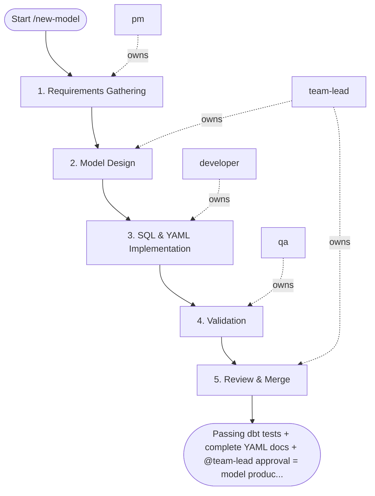

## Steps

### 1. Requirements Gathering — `@pm`
- **Input:** model request
- **Actions:** confirm model name (snake_case), target layer (staging / intermediate / mart), source table, business purpose, and key metrics or grain
- **Output:** confirmed model spec
- **Done when:** spec unambiguous; `@team-lead` briefed

### 2. Model Design — `@team-lead`
- **Input:** confirmed model spec
- **Actions:** determine grain and primary key; identify required joins and business logic; specify standard tests (unique, not_null, relationships, recency for time-series); review lineage impact using `/lineage-trace` if modifying shared tables
- **Output:** design note with grain, PK, test list, lineage notes
- **Done when:** design approved; no lineage conflicts

### 3. SQL & YAML Implementation — `@developer`
- **Input:** design note
- **Actions:**
  - staging: SELECT with column renaming, type casting, deduplication
  - intermediate: business logic JOIN template
  - mart: fact/dimension template with surrogate key and audit columns
  - generate YAML docs: model description, auto-detected columns, standard tests
- **Output:** `models/<layer>/<model_name>.sql` + `<model_name>.yml`
- **Done when:** SQL implemented; YAML complete with all columns described

### 4. Validation — `@qa`
- **Input:** model files
- **Actions:** `dbt compile --select <model_name>`; `dbt test --select <model_name> --empty`; compare compiled SQL against design; verify tests are sufficient for the grain and business rules
- **Output:** validation report; compiled SQL preview
- **Done when:** `dbt compile` and `dbt test` pass; `@qa` confirms test coverage adequate

### 5. Review & Merge — `@team-lead`
- **Input:** validated model
- **Actions:** review SQL logic, naming conventions, documentation completeness; approve or return with blocking feedback
- **Done when:** `@team-lead` approves; PR merged

## Agent Interaction Diagram

<!-- agent-diagram:start -->

<!-- agent-diagram:end -->

## Exit
Passing dbt tests + complete YAML docs + `@team-lead` approval = model production-ready.

**Next:** terminal — no follow-up workflow.
