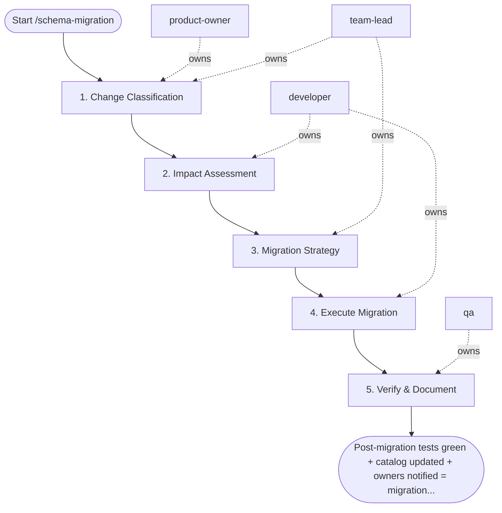

## Steps

1. Change Classification — `@product-owner` + `@team-lead`
- **Input:** table name, change type (rename-column / add-column / change-type / drop-column)
- **Actions:** classify as non-breaking (add nullable column → proceed to Step 3) or breaking (requires full impact assessment)
- **Output:** classification decision
- **Done when:** classification confirmed

### 2. Impact Assessment — `@developer` (breaking changes only)
- **Input:** breaking change classification
- **Actions:** run `/lineage-trace` to identify all affected downstream models and dashboards; notify downstream owners with minimum 5-business-day notice
- **Output:** impact report with affected asset list; notification sent
- **Done when:** all downstream owners acknowledged

### 3. Migration Strategy — `@team-lead`
- **Input:** confirmed change + impact report
- **Actions:** define migration phases:
  - column rename: Phase 1 add new column + populate from old; Phase 2 migrate downstream; Phase 3 mark old deprecated; Phase 4 (30 days later) drop old
  - type change: use CAST-safe intermediate column
  - drop: only after all references removed
- **Output:** migration strategy doc with phase timeline
- **Done when:** strategy approved; `@developer` can implement

### 4. Execute Migration — `@developer`
- **Input:** approved strategy
- **Actions:** generate and review migration SQL; run in staging first; validate with dbt tests in staging; execute in production in off-peak window
- **Output:** migration applied to production
- **Done when:** migration runs without error; no rollback triggered

### 5. Verify & Document — `@qa`
- **Input:** migrated production schema
- **Actions:** confirm all dbt tests pass post-migration; update YAML docs and data catalog; announce completion to downstream owners
- **Output:** `validation_report.md`; catalog updated; owners notified
- **Done when:** all tests green; documentation current

## Agent Interaction Diagram

<!-- agent-diagram:start -->

<!-- agent-diagram:end -->

## Exit
Post-migration tests green + catalog updated + owners notified = migration complete.
