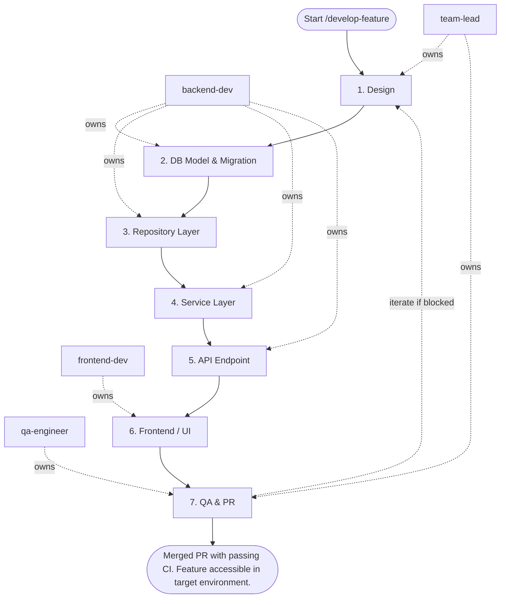

## Steps

### 1. Design — `@team-lead`
- **Input:** feature description, acceptance criteria
- **Actions:** clarify domain model changes; draft API contract (endpoint, request/response schema, error codes); identify DB schema changes needed; flag breaking changes
- **Output:** `design/feature-<name>.md` — API contract + data model
- **Done when:** API contract approved (user or tech lead sign-off)

### 2. DB Model & Migration — `@backend-dev`
- **Input:** `design/feature-<name>.md`
- **Actions:** define/update SQLAlchemy models; generate Alembic migration (`alembic revision --autogenerate`); review migration file — check for unsafe operations (column rename, NOT NULL without default); run `alembic upgrade head`
- **Output:** migration file in `alembic/versions/`; updated `models/`
- **Done when:** `alembic upgrade head` succeeds; existing tests still pass

### 3. Repository Layer — `@backend-dev`
- **Input:** updated models
- **Actions:** implement CRUD operations in `repositories/`; use `AsyncSession`; apply cursor-based pagination for list queries; write repository unit tests with transaction rollback isolation
- **Output:** `repositories/<entity>_repo.py` + tests
- **Done when:** repository tests pass; no business logic in repo layer

### 4. Service Layer — `@backend-dev`
- **Input:** repository layer
- **Actions:** implement business logic in `services/`; enforce invariants; manage transactions (`async with session.begin()`); emit domain events if needed; write service unit tests with fake repository
- **Output:** `services/<entity>_service.py` + tests
- **Done when:** service tests pass; service imports only repository, not DB directly

### 5. API Endpoint — `@backend-dev`
- **Input:** service layer, API contract from Step 1
- **Actions:** implement FastAPI endpoint in `api/v1/endpoints/`; validate inputs via Pydantic schemas; use FastAPI `Depends()` for auth + DB; apply correct HTTP status codes; write API integration tests
- **Output:** endpoint file + `schemas/<entity>.py` + integration tests
- **Done when:** endpoint matches contract from Step 1; auth + validation tested; `make lint` clean

### 6. Frontend / UI — `@frontend-dev`
- **Input:** API contract, acceptance criteria
- **Actions:** implement UI changes (component, page, server action); connect to API; handle loading/error/empty states; add `data-testid` for E2E selectors
- **Output:** updated `features/<name>/` directory
- **Done when:** feature visible and functional in dev; all states handled

### 7. QA & PR — `@qa-engineer` + `@team-lead`
- **Input:** complete implementation
- **Actions:** write/run E2E test covering acceptance criteria; run full test suite (`make test`); verify no ruff/mypy errors; create PR with: description, test evidence (output), design doc link
- **Output:** passing CI + PR ready for review
- **Done when:** `make test` green; `make lint` clean; PR submitted

## Agent Interaction Diagram

<!-- agent-diagram:start -->

<!-- agent-diagram:end -->

## Iteration Loop
If review finds issues → return to relevant step (Step 2 for schema issues, Step 4 for logic issues, Step 5 for API issues).

## Exit
Merged PR with passing CI. Feature accessible in target environment.
