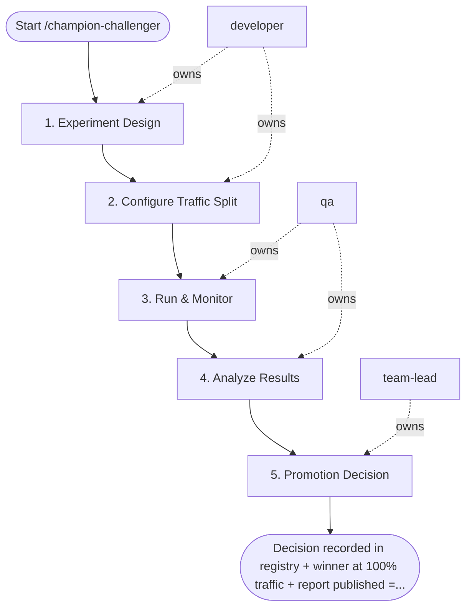

## Steps

### 1. Experiment Design — `@developer`
- **Input:** champion, challenger, duration
- **Actions:** define primary metric (business outcome); calculate required sample size (80% power, α=0.05); define guardrail metrics (latency, error rate); document in experiment tracker
- **Output:** experiment design doc with sample size and guardrails
- **Done when:** `@team-lead` approves design

### 2. Configure Traffic Split — `@developer`
- **Input:** approved design
- **Actions:** hash `user_id` for consistent assignment; 50% champion / 50% challenger; log assignment to experiment tracker
- **Output:** traffic split active
- **Done when:** split verified in logs; both models receiving traffic

### 3. Run & Monitor — `@qa`
- **Input:** active experiment
- **Actions:** monitor guardrail metrics daily; if guardrail breached → auto-rollback to champion; run for full planned duration unless guardrail breach
- **Output:** daily monitoring logs; guardrail status
- **Done when:** experiment duration complete or guardrail triggered rollback

### 4. Analyze Results — `@qa`
- **Input:** experiment logs
- **Actions:** compute statistical significance of primary metric; segment analysis: is challenger better for ALL segments?; document practical significance alongside statistical
- **Output:** `experiment_results.md` — p-value, effect size, segment breakdown
- **Done when:** analysis complete; results ready for decision

### 5. Promotion Decision — `@team-lead`
- **Input:** experiment results
- **Actions:** p < 0.05 AND practical significance AND no harm to any segment → PROMOTE challenger; otherwise → KEEP champion; route 100% to winner; archive loser; write experiment report for model registry
- **Output:** experiment report in registry; traffic routed to winner
- **Done when:** winner in production; loser archived; report complete

## Agent Interaction Diagram

<!-- agent-diagram:start -->

<!-- agent-diagram:end -->

## Exit
Decision recorded in registry + winner at 100% traffic + report published = experiment closed.

**Next:** /deploy-endpoint — promote the winning model; otherwise terminal.
