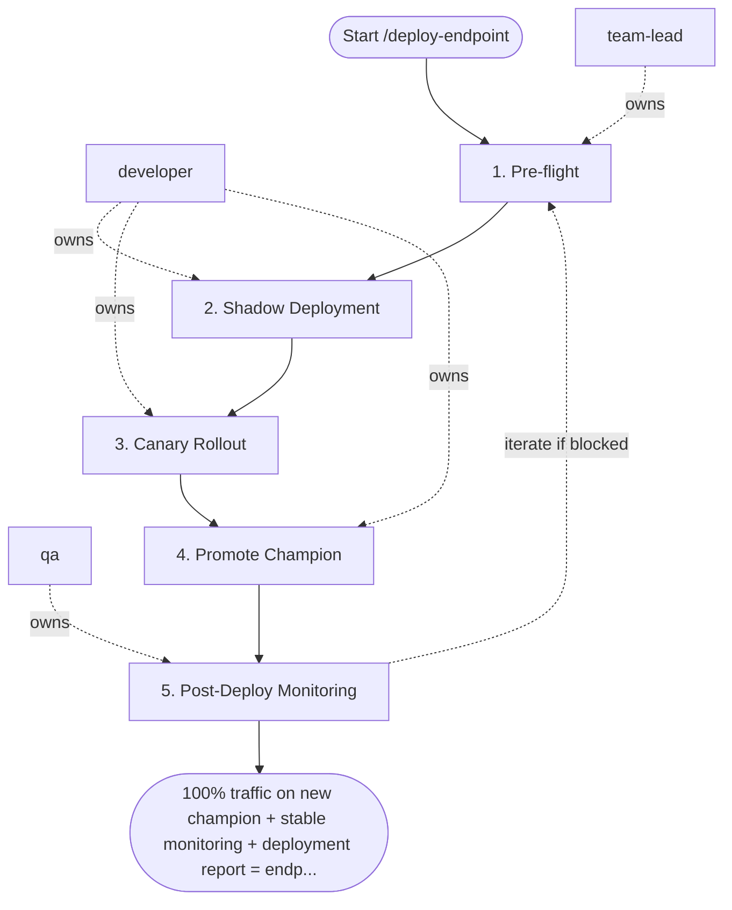

## Steps

### 1. Pre-flight — `@team-lead`
- **Input:** model run ID
- **Actions:** confirm model passed `/evaluate-model` with PROMOTE recommendation; verify human approval recorded in model registry; check production endpoint health; confirm no active P0/P1 incidents
- **Output:** pre-flight sign-off
- **Done when:** all checks pass; deployment may proceed

### 2. Shadow Deployment — `@developer` (if `--shadow`)
- **Input:** pre-flight sign-off
- **Actions:** deploy alongside current champion; 100% traffic to champion; mirror requests to challenger (no user-facing response from challenger); run shadow ≥ 48 hours; compare predictions for distribution drift
- **Output:** shadow comparison report
- **Done when:** no significant prediction distribution drift detected

### 3. Canary Rollout — `@developer`
- **Input:** shadow report (or pre-flight if skipping shadow)
- **Actions:** serve challenger to 5% of traffic; monitor 30 minutes:
  - latency p99 > SLO → AUTO-ROLLBACK
  - error rate > 1% → AUTO-ROLLBACK
  - gradually increase: 5% → 20% → 50% → 100%
- **Output:** canary metrics per traffic split
- **Done when:** 100% traffic on challenger with no SLO breaches

### 4. Promote Champion — `@developer`
- **Input:** successful canary
- **Actions:** transition challenger: Staging → Production in registry; demote old champion: Production → Archived
- **Output:** registry updated; old champion archived
- **Done when:** registry state reflects new champion

### 5. Post-Deploy Monitoring — `@qa`
- **Input:** live endpoint
- **Actions:** establish new baseline for drift monitoring; confirm monitoring dashboards updated; observe first 24 hours for anomalies
- **Output:** `deployment_report.md` — timeline, traffic split results, new baselines
- **Done when:** stable 24 hours; report complete

## Agent Interaction Diagram

<!-- agent-diagram:start -->

<!-- agent-diagram:end -->

## Iteration Loop
Auto-rollback on SLO breach returns to Step 2 (shadow) or Step 1 (full re-review). At most 2 automatic rollback-and-retry cycles per model version; a third SLO breach freezes the deployment and escalates to `@team-lead`.

## Exit
100% traffic on new champion + stable monitoring + deployment report = endpoint promoted.

**Next:** /model-incident — if the endpoint breaches SLO in production; otherwise terminal — no follow-up workflow.
