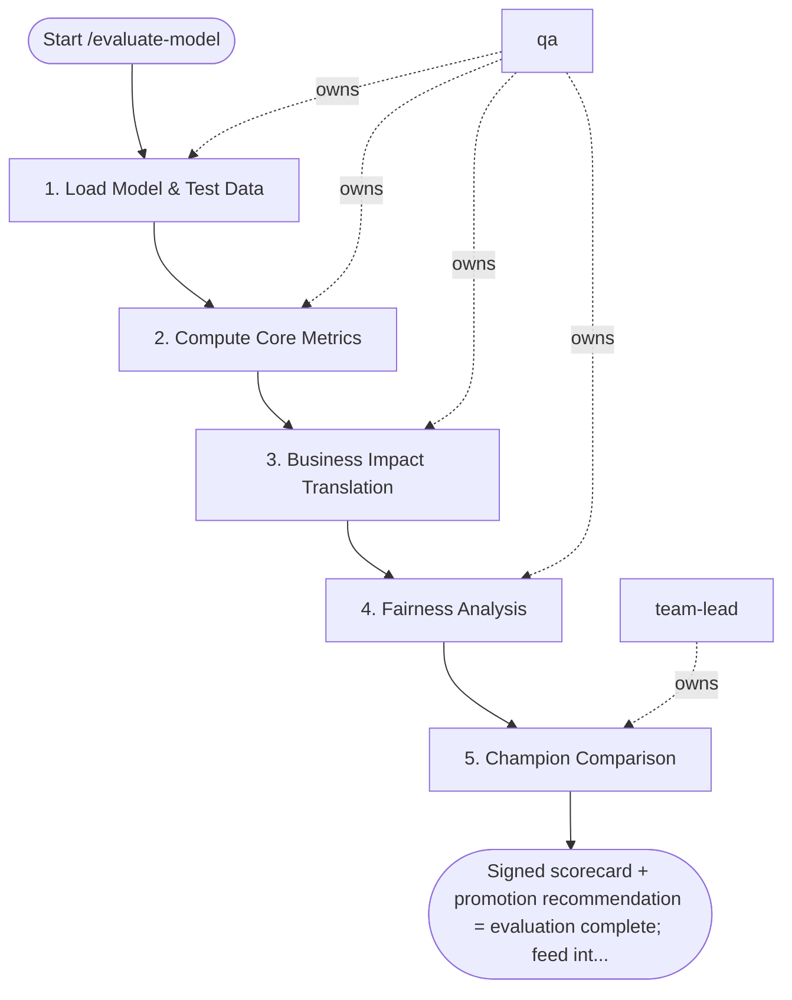

## Steps

### 1. Load Model & Test Data — `@qa`
- **Input:** MLflow run ID
- **Actions:** retrieve model artifact from MLflow run; load held-out test set from the data version recorded in the run; confirm test set was NOT used during any training iteration
- **Output:** model and test data loaded
- **Done when:** data provenance confirmed; no leakage

### 2. Compute Core Metrics — `@qa`
- **Input:** model + test data
- **Actions:** classification: AUC-ROC, F1, Precision, Recall, PR-AUC; regression: MAE, RMSE, R², MAPE; save raw metric values to MLflow run
- **Output:** core metrics logged
- **Done when:** all applicable metrics computed

### 3. Business Impact Translation — `@qa`
- **Input:** core metrics
- **Actions:** translate statistical metrics to business impact (e.g. "At 80% precision, identifies 62% of churners — est. $120K saved/month"); document assumptions in scorecard
- **Output:** business impact statement in scorecard
- **Done when:** at least one business metric derived

### 4. Fairness Analysis — `@qa` (if model affects people)
- **Input:** model predictions + protected group labels
- **Actions:** compute demographic parity difference across protected groups; flag if disparity > 0.1 — requires `@team-lead` human review before promotion
- **Output:** fairness report; flag if human review needed
- **Done when:** fairness check complete; no unreviewed disparity > 0.1

### 5. Champion Comparison — `@team-lead`
- **Input:** challenger metrics + champion from Production stage in registry
- **Actions:** run statistical significance test; review scorecard; make promotion decision: PROMOTE / DO_NOT_PROMOTE / NEEDS_REVIEW
- **Output:** `evaluation_scorecard.json` with recommendation; visualizations (confusion matrix, ROC, feature importance)
- **Done when:** recommendation recorded in model registry

## Agent Interaction Diagram

<!-- agent-diagram:start -->

<!-- agent-diagram:end -->

## Exit
Signed scorecard + promotion recommendation = evaluation complete; feed into `/deploy-endpoint` or `/champion-challenger`.
