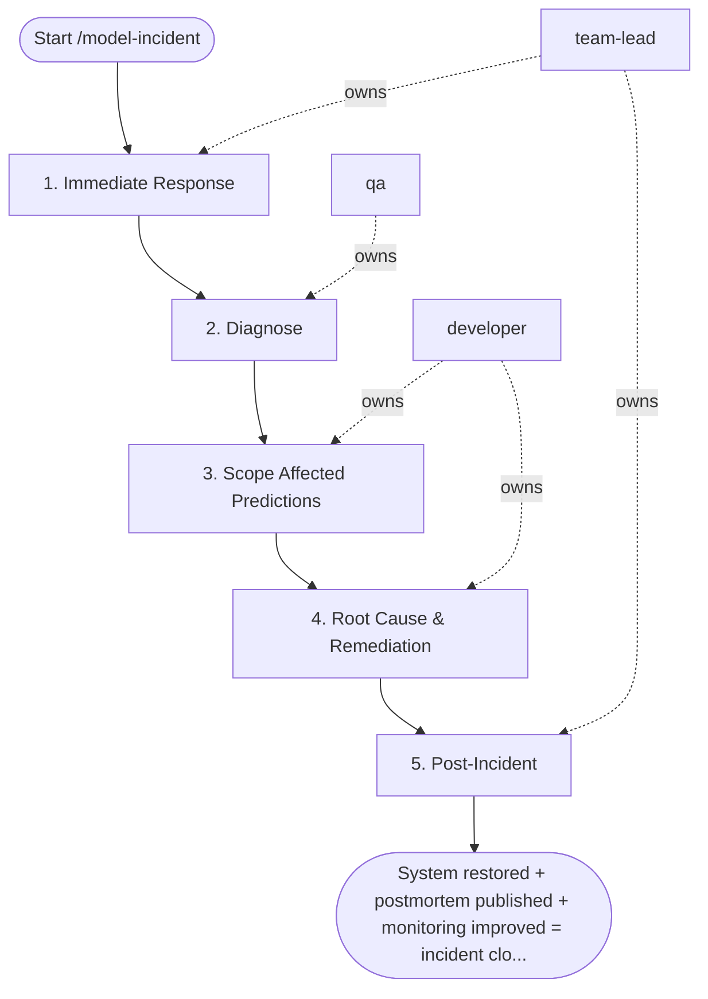

## Steps

### 1. Immediate Response — `@team-lead`
- **Input:** incident alert
- **Actions:** assess impact (users affected? incorrect decisions made?); decide: tolerate degraded predictions or rollback NOW?; if critical → rollback to previous champion (< 5 min target)
- **Output:** rollback decision; incident severity classification
- **Done when:** system stabilized (rollback applied or consciously tolerated)

### 2. Diagnose — `@qa`
- **Input:** incident type
- **Actions:** drift → compare input distributions to training baseline (PSI); degradation → compare business metrics to post-deployment baseline; outage → check endpoint health, container logs, resource utilization; bias → compute fairness metrics for affected period
- **Output:** diagnosis report with evidence
- **Done when:** root cause category identified

### 3. Scope Affected Predictions — `@developer`
- **Input:** diagnosis report
- **Actions:** identify time window of degradation; log which predictions were made during affected window; notify downstream systems consuming model output
- **Output:** affected prediction log; downstream teams notified
- **Done when:** full impact window documented

### 4. Root Cause & Remediation — `@developer`
- **Input:** affected window + diagnosis
- **Actions:** data drift → schedule retraining with `/train-experiment`; model rot → `/train-experiment` with recent data; infrastructure → fix pipeline, verify feature consistency; code bug → implement fix, run `/evaluate-model` before re-deploying
- **Circuit breaker:** the incident → `/train-experiment` → `/evaluate-model` → `/deploy-endpoint` chain may be traversed at most once automatically per incident; if the redeployed model breaches again, keep the endpoint rolled back and escalate to `@team-lead` for human review
- **Output:** remediation action taken
- **Done when:** root cause fixed; new model validated or pipeline restored

### 5. Post-Incident — `@team-lead`
- **Input:** resolved incident
- **Actions:** add monitoring rule to catch pattern earlier; write postmortem; update model card with known failure modes
- **Output:** postmortem at `docs/incidents/<date>-<model>-root-cause.md`; monitoring updated; model card updated
- **Done when:** postmortem reviewed; prevention measures in place

## Agent Interaction Diagram

<!-- agent-diagram:start -->

<!-- agent-diagram:end -->

## Exit
System restored + postmortem published + monitoring improved = incident closed.

**Next:** /train-experiment — when retraining is the remediation (bounded by the Step 4 circuit breaker); otherwise terminal — no follow-up workflow.
