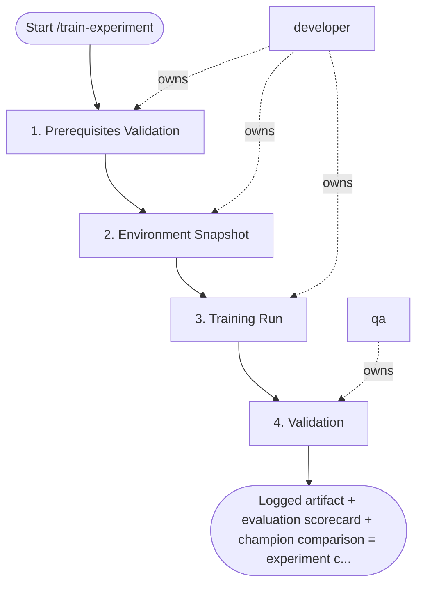

## Steps

### 1. Prerequisites Validation — `@developer`
- **Input:** model name, config YAML
- **Actions:** confirm data version exists and quality checks passed; verify training config YAML is valid; check compute resource budget
- **Output:** validation confirmation
- **Done when:** all prerequisites met; no blockers

### 2. Environment Snapshot — `@developer`
- **Input:** validated prerequisites
- **Actions:** log git commit hash; build/verify training Docker image digest; register data snapshot version in MLflow
- **Output:** immutable environment record in MLflow run
- **Done when:** snapshot logged; run is reproducible from this state

### 3. Training Run — `@developer`
- **Input:** snapshotted environment
- **Actions:** submit job to training cluster; stream training logs; surface loss curves in real-time; monitor for anomalies (NaN loss, divergence)
- **Output:** completed training run; model artifact in MLflow
- **Done when:** all epochs completed; loss decreased; artifact logged

### 4. Validation — `@qa`
- **Input:** completed run
- **Actions:** confirm training loss decreased monotonically; verify model artifact logged correctly; run `/evaluate-model` automatically; compare against current champion
- **Output:** evaluation scorecard; comparison vs. top 3 previous runs
- **Done when:** evaluation complete; recommendation produced (promote / continue tuning / investigate)

## Agent Interaction Diagram

<!-- agent-diagram:start -->

<!-- agent-diagram:end -->

## Exit
Logged artifact + evaluation scorecard + champion comparison = experiment complete.

**Next:** /evaluate-model — evaluate the trained candidate.
