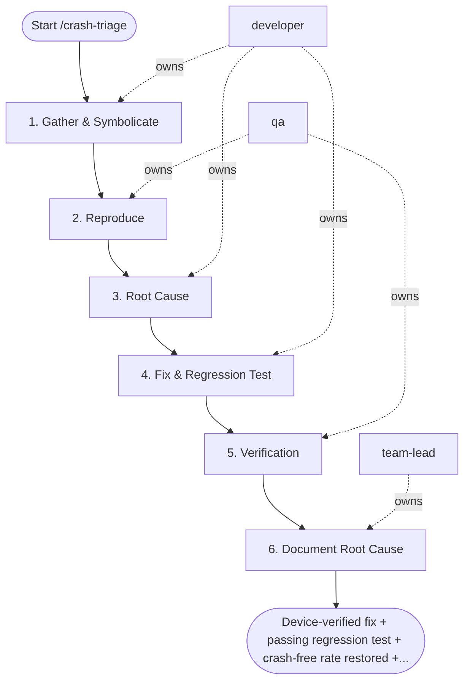

## Steps

### 1. Gather & Symbolicate — `@developer`
- **Input:** platform (ios/android), version
- **Actions:** fetch crash-free rate by version from Firebase/Crashlytics; pull crash logs for target version; identify top 3 crash signatures; iOS → download dSYM from App Store Connect, symbolicate; Android → use ProGuard mapping to deobfuscate
- **Output:** symbolicated crash report; top 3 signatures identified
- **Done when:** readable stack traces available

### 2. Reproduce — `@qa`
- **Input:** symbolicated crash report with breadcrumbs
- **Actions:** identify reproduction conditions from breadcrumbs/logs; attempt reproduction in debug build; if not reproducible in simulator → test on physical device; document minimal reproduction steps
- **Output:** confirmed reproduction steps
- **Done when:** crash reliably reproducible

### 3. Root Cause — `@developer`
- **Input:** reproduction steps
- **Actions:** map crash to source code location; determine: our code vs. third-party library?; check recent commits touching this file: `git log -p -- <file>`
- **Output:** root cause identified; suspected commit or code path
- **Done when:** root cause confirmed

### 4. Fix & Regression Test — `@developer`
- **Input:** confirmed root cause
- **Actions:** implement fix with regression test; confirm fix on physical device before submitting; if crash-free rate < 99% → trigger `/ota-update` (JS change) or `/store-submission` (native change) — at most one automatic re-trigger between `/crash-triage` and `/ota-update` or `/store-submission` per release; if crash-free rate is still below target after the re-shipped build, halt automatic loops and escalate to `@team-lead`
- **Output:** fix + regression test on branch; device-verified
- **Done when:** fix confirmed on device; regression test passes

### 5. Verification — `@qa`
- **Input:** fix branch
- **Actions:** reproduce original crash with fix applied — confirm resolved; run device test matrix on fix build; verify crash-free rate meets threshold in pre-release track
- **Output:** verification report with device results
- **Done when:** crash resolved on all tested devices; crash-free rate confirmed

### 6. Document Root Cause — `@team-lead`
- **Input:** verification report
- **Actions:** write `docs/incidents/<date>-crash-<slug>-root-cause.md` covering root cause, fix, and prevention follow-ups
- **Output:** root-cause doc committed
- **Done when:** doc merged under `docs/incidents/`

## Agent Interaction Diagram

<!-- agent-diagram:start -->

<!-- agent-diagram:end -->

## Exit
Device-verified fix + passing regression test + crash-free rate restored + root-cause doc committed = triage complete.

**Next:** /ota-update or /store-submission — when a fix ships (one automatic pass per release); otherwise terminal — no follow-up workflow.
