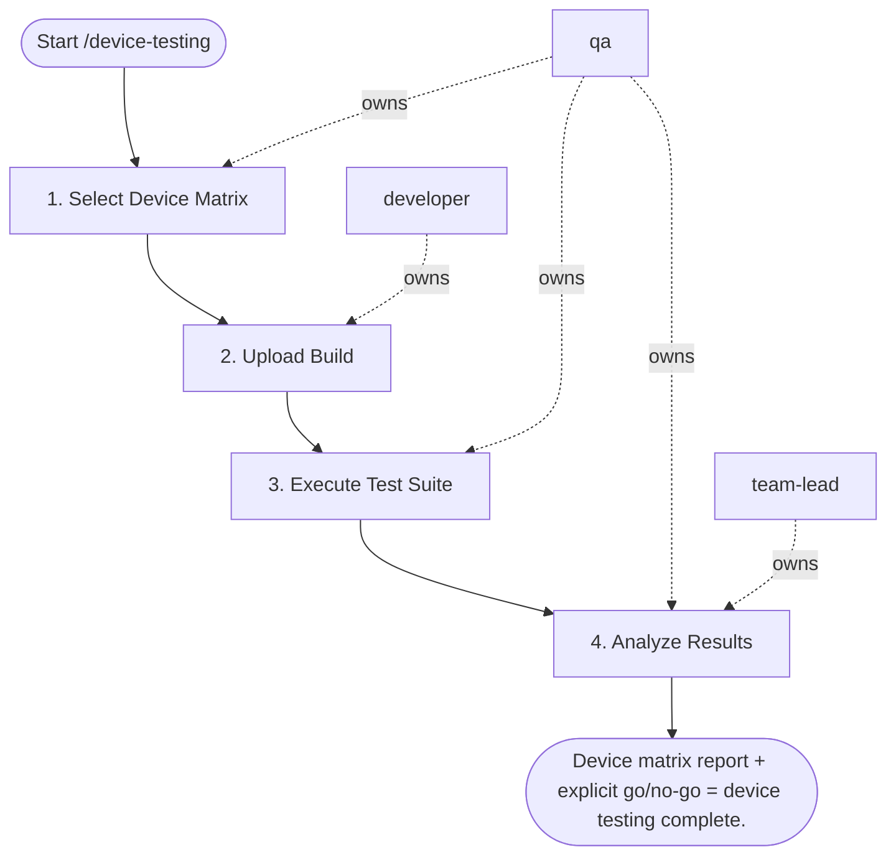

## Steps

### 1. Select Device Matrix — `@qa`
- **Input:** platform (ios / android / all)
- **Actions:** iOS: latest 2 iOS versions × [iPhone SE, iPhone 15, iPad]; Android: latest 2 Android versions × [low-end, mid-range, high-end]
- **Output:** confirmed device matrix
- **Done when:** matrix defined; device farm slots available

### 2. Upload Build — `@developer`
- **Input:** device matrix
- **Actions:** upload IPA/APK to device farm (AWS Device Farm / BrowserStack)
- **Output:** build available on device farm
- **Done when:** upload confirmed; build ID recorded

### 3. Execute Test Suite — `@qa`
- **Input:** uploaded build + device matrix
- **Actions:** run Detox (or project test framework) test suite on all matrix devices; capture per device: video, screenshots, logs, performance metrics
- **Output:** raw test results per device
- **Done when:** all devices executed; evidence captured

### 4. Analyze Results — `@qa` + `@team-lead`
- **Input:** raw results
- **Actions:** flag device-specific failures (not present in emulator); check: layout issues, performance variations, permission dialog handling; classify: critical (blocks release) vs. minor (track); block release if critical tests fail on > 20% of device matrix
- **Output:** pass/fail matrix by device × test; failure screenshots with device context
- **Done when:** all failures classified; release recommendation made

## Agent Interaction Diagram

<!-- agent-diagram:start -->

<!-- agent-diagram:end -->

## Exit
Device matrix report + explicit go/no-go = device testing complete.
