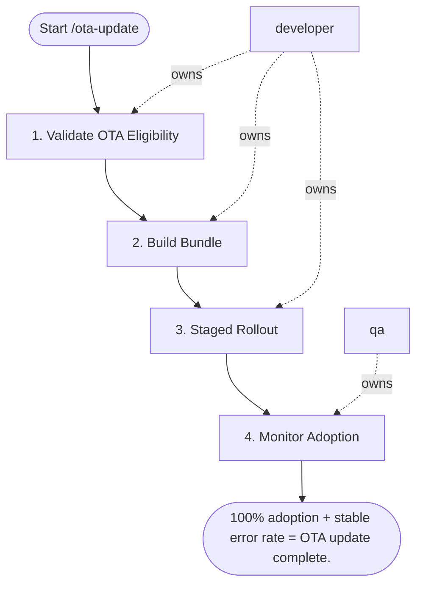

## Steps

### 1. Validate OTA Eligibility — `@developer`
- **Input:** change description
- **Actions:** confirm change is JS-only — no native module changes; check for any new native dependencies → if found: HALT and use `/store-submission`
- **Output:** eligibility confirmed
- **Done when:** JS-only change verified; native deps unchanged

### 2. Build Bundle — `@developer`
- **Input:** eligibility confirmation
- **Actions:** compile JS bundle for production; verify bundle size is within project budget; test bundle locally before deploying
- **Output:** production JS bundle
- **Done when:** bundle builds clean; size within budget

### 3. Staged Rollout — `@developer`
- **Input:** production bundle
- **Actions:** deploy to 5% of users; monitor crash-free rate and JS error rate for 1 hour; if stable → expand to 50% → 100%; rollback command ready: `expo update:rollback` / `CodePush rollback`
- **Output:** staged rollout active; monitoring in progress
- **Done when:** 100% of users on new bundle with no incidents

### 4. Monitor Adoption — `@qa`
- **Input:** active rollout
- **Actions:** track bundle adoption %; expected full adoption: 24–48 hours; monitor JS error rate throughout adoption window
- **Output:** adoption report with timeline and error rate
- **Done when:** full adoption reached; no error rate regression

## Agent Interaction Diagram

<!-- agent-diagram:start -->

<!-- agent-diagram:end -->

## Exit
100% adoption + stable error rate = OTA update complete.
