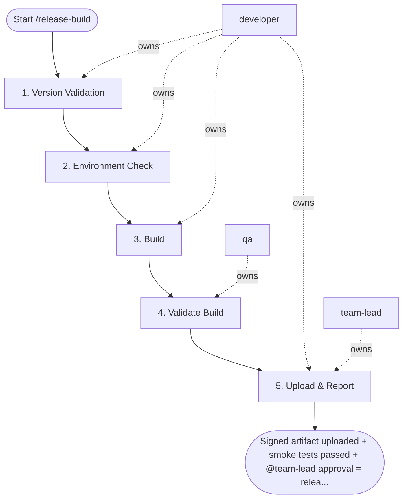

## Steps

### 1. Version Validation — `@developer`
- **Input:** version string
- **Actions:** confirm semver format; increment build number (versionCode / CFBundleVersion); verify git tag does not already exist
- **Output:** version confirmed; git tag reserved
- **Done when:** version unambiguous; no tag conflicts

### 2. Environment Check — `@developer`
- **Input:** target environment (staging / production)
- **Actions:** correct `.env` file loaded (no dev endpoints); all required env vars populated; no debug flags set (`DEV=false`, `FLIPPER=false`, sentry set to production DSN)
- **Output:** environment validation passed
- **Done when:** zero dev/debug flags in release config

### 3. Build — `@developer`
- **Input:** validated environment
- **Actions:**
  - iOS: `cd ios && pod install`; `xcodebuild archive -scheme MyApp -configuration Release`; export IPA with production signing profile
  - Android: `./gradlew clean`; `./gradlew bundleRelease`; sign with release keystore (credentials from CI secrets)
  - if signing fails: verify certificates and provisioning profiles (validity, expiry, team ID); maximum 2 retries, then escalate to `@team-lead`
- **Output:** IPA (iOS) / AAB (Android) artifact
- **Done when:** build exits 0; artifact produced

### 4. Validate Build — `@qa`
- **Input:** build artifact
- **Actions:** install on physical device; run Detox smoke tests; verify: launch, login, core action, crash-free; confirm no dev/debug indicators visible in UI
- **Output:** smoke test evidence; device validation record
- **Done when:** all smoke tests pass on physical device

### 5. Upload & Report — `@developer` + `@team-lead`
- **Input:** validated artifact
- **Actions:** `@team-lead` reviews smoke evidence; `@developer` uploads to TestFlight (iOS) or Firebase App Distribution (Android); record artifact path with hash; notify QA and PM
- **Output:** artifact uploaded; hash recorded; team notified
- **Done when:** upload confirmed; team has TestFlight/App Distribution link

## Agent Interaction Diagram

<!-- agent-diagram:start -->

<!-- agent-diagram:end -->

## Exit
Signed artifact uploaded + smoke tests passed + `@team-lead` approval = release build complete.

**Next:** /store-submission — pass `build_path` (the uploaded artifact) as input.
