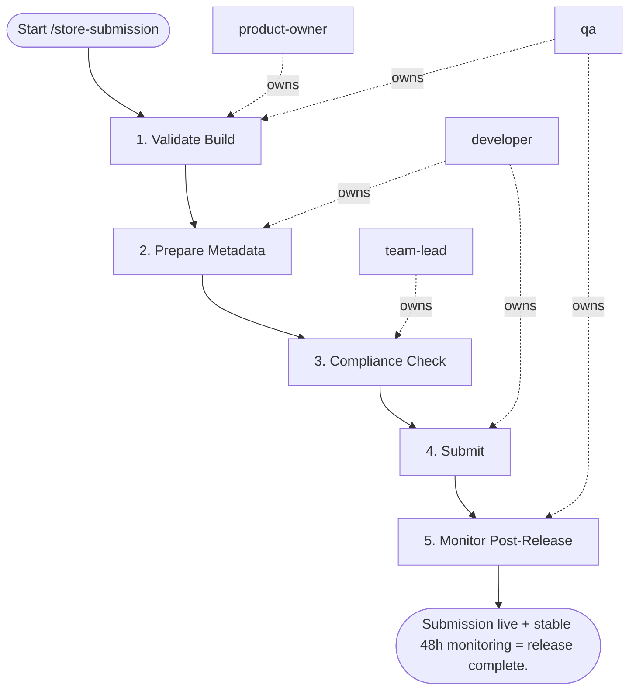

## Steps

1. Validate Build — `@product-owner` + `@qa`
- **Input:** build artifact
- **Actions:** confirm all quality gates passed; physical device tests passed; crash-free rate in pre-release track ≥ 99.5%; run `app-store-prep` skill compliance checklist
- **Output:** quality gate sign-off
- **Done when:** all gates passed; `@team-lead` approves

### 2. Prepare Metadata — `@developer`
- **Input:** approved build
- **Actions:** update release notes (localized if applicable); update screenshots if UI changed; update app description if features changed
- **Output:** updated store metadata
- **Done when:** metadata reflects current release

### 3. Compliance Check — `@team-lead`
- **Input:** metadata + build
- **Actions:** privacy labels match actual data collection; permission usage descriptions current; no undisclosed data sharing; verify age rating is correct
- **Output:** compliance sign-off
- **Done when:** all compliance items confirmed

### 4. Submit — `@developer`
- **Input:** compliance-approved build + metadata
- **Actions:** iOS: upload IPA via Transporter → submit for App Review (24–48h); Android: upload AAB to internal track → promote: internal → closed → production (20% initial rollout)
- **Output:** submission confirmation
- **Done when:** submission received by store

### 5. Monitor Post-Release — `@qa`
- **Input:** live release
- **Actions:** watch for rating spike (negative reviews may indicate regression); monitor crash-free rate for first 48 hours; respond to App Review feedback if rejection; escalate to `/crash-triage` if crash-free rate drops
- **Output:** post-release monitoring report (48h window)
- **Done when:** 48 hours stable; no new critical issues

## Agent Interaction Diagram

<!-- agent-diagram:start -->

<!-- agent-diagram:end -->

## Exit
Submission live + stable 48h monitoring = release complete.
