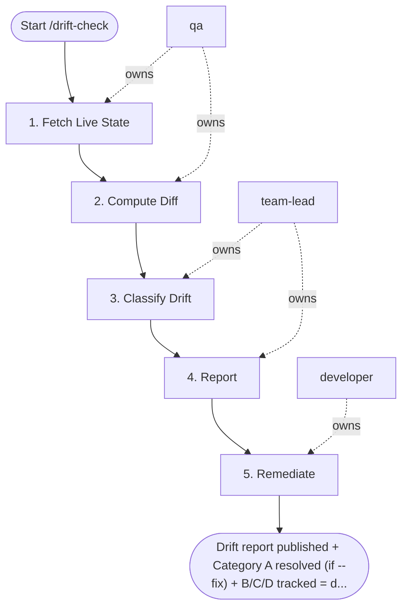

## Steps

### 1. Fetch Live State — `@qa`
- **Input:** target environment
- **Actions:** `terraform refresh` for target environment; ensure state backend is up to date
- **Output:** refreshed state
- **Done when:** state reflects current cloud reality

### 2. Compute Diff — `@qa`
- **Input:** refreshed state
- **Actions:** `terraform plan -detailed-exitcode`; exit code 2 = drift detected; capture full diff output
- **Output:** diff report
- **Done when:** drift computed; exit code recorded

### 3. Classify Drift — `@team-lead`
- **Input:** diff report
- **Actions:** A: tag-only drift → auto-fixable, low risk; B: config drift → review required; C: missing resource (created manually) → investigate origin; D: unexpected destroy → CRITICAL, page on-call immediately
- **Output:** drift classification per item
- **Done when:** all drift items classified

### 4. Report — `@team-lead`
- **Input:** classified drift
- **Actions:** post summary to Slack `#infra-alerts`; Category D → page on-call immediately, do not wait
- **Output:** Slack notification; on-call paged if D
- **Done when:** team informed

### 5. Remediate — `@developer` (if `--fix` flag)
- **Input:** classified drift
- **Actions:** auto-apply Category A only: `terraform apply -target=<resource>`; for B/C/D: create GitHub issue, assign to IaC owner; do NOT auto-apply B/C/D
- **Output:** Category A drift resolved; issues created for B/C/D
- **Done when:** Category A applied; B/C/D tracked in issues

## Agent Interaction Diagram

<!-- agent-diagram:start -->

<!-- agent-diagram:end -->

## Exit
Drift report published + Category A resolved (if --fix) + B/C/D tracked = drift check complete.
