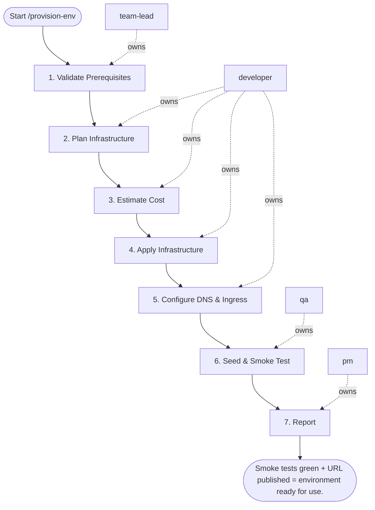

## Steps

### 1. Validate Prerequisites — `@team-lead`
- **Input:** environment type, branch
- **Actions:** check cloud credentials active; verify Terraform state backend accessible; confirm no active locks on target environment state
- **Output:** prerequisites confirmed
- **Done when:** no locks; credentials valid

### 2. Plan Infrastructure — `@developer`
- **Input:** validated prerequisites
- **Actions:** `terraform init -reconfigure`; `terraform plan -out=tfplan`; if destroyed resources > 0 in non-preview env → HALT, request manual approval
- **Output:** `tfplan` artifact; destroy count confirmed
- **Done when:** plan reviewed; no unexpected destroys

### 3. Estimate Cost — `@developer`
- **Input:** tfplan
- **Actions:** `infracost breakdown --path tfplan`; HALT if delta > $500/month for preview environments
- **Output:** cost estimate; approval if within budget
- **Done when:** cost within budget; `@team-lead` approves

### 4. Apply Infrastructure — `@developer`
- **Input:** approved plan + cost estimate
- **Actions:** `terraform apply tfplan`; capture all outputs (endpoints, ARNs)
- **Output:** infrastructure provisioned; outputs captured
- **Done when:** apply exits 0; all resources created

### 5. Configure DNS & Ingress — `@developer`
- **Input:** infrastructure outputs
- **Actions:** register subdomain: `<branch>.staging.mycompany.com`; wait for SSL certificate validation; verify HTTPS endpoint responds
- **Output:** DNS and SSL active; HTTPS confirmed
- **Done when:** HTTPS endpoint reachable

### 6. Seed & Smoke Test — `@qa`
- **Input:** running environment
- **Actions:** run database migrations; run smoke test suite against new environment
- **Output:** smoke test results; environment validated
- **Done when:** smoke tests pass; environment confirmed functional

### 7. Report — `@pm`
- **Input:** validated environment
- **Actions:** post environment URL to PR comment; include: all endpoints, credentials location, teardown command
- **Output:** environment URL published in PR
- **Done when:** team has access and teardown instructions

## Agent Interaction Diagram

<!-- agent-diagram:start -->

<!-- agent-diagram:end -->

## Exit
Smoke tests green + URL published = environment ready for use.

**Next:** terminal — no follow-up workflow.
