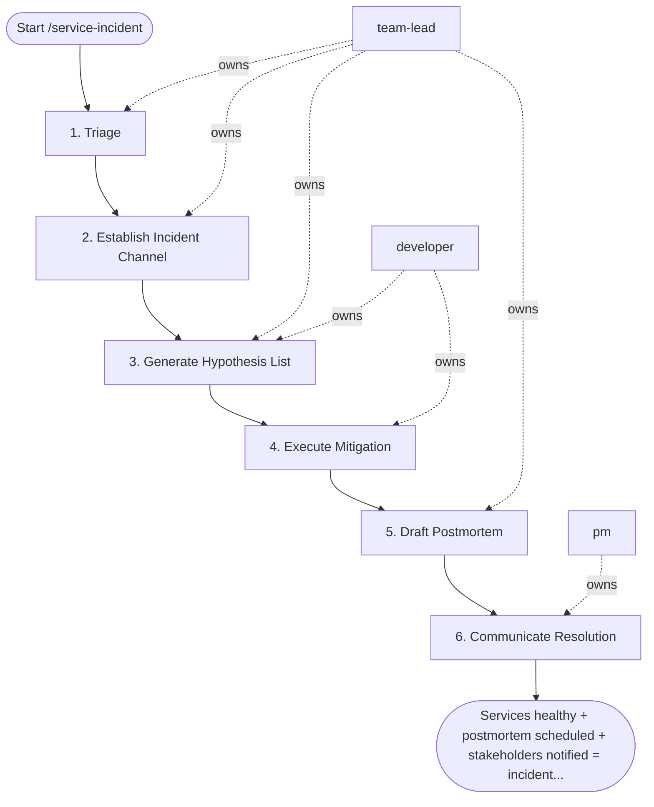

## Steps

### 1. Triage — `@team-lead`
- **Input:** incident alert, severity
- **Actions:** fetch last 30 min of metrics for named service; check recent deployments (last 2 hours); identify correlated alerts; confirm severity classification
- **Output:** severity confirmed; initial impact summary
- **Done when:** impact is understood; owner assigned

### 2. Establish Incident Channel — `@team-lead`
- **Input:** confirmed severity
- **Actions:** create `#incident-YYYY-MM-DD-<service>` Slack channel; post initial summary: what's broken, impact, timeline, current hypothesis
- **Output:** incident channel active; team assembled
- **Done when:** all relevant responders in channel

### 3. Generate Hypothesis List — `@team-lead` + `@developer`
- **Input:** metrics + recent deployment history
- **Actions:** surface top 3 most likely causes: recent deployment? → test rollback hypothesis; DB connection errors? → check pool exhaustion runbook; 5xx spike? → check upstream dependencies
- **Output:** prioritized hypothesis list with runbook links
- **Done when:** top hypothesis identified; runbook commands ready

### 4. Execute Mitigation — `@developer`
- **Input:** prioritized hypothesis list + runbook links from step 3
- **Actions:** per hypothesis (most likely first): provide exact kubectl / aws / psql commands; execute; monitor 2 minutes; if metrics improve → STABILIZE; else → next hypothesis; if all listed hypotheses are exhausted without stabilization → stop, escalate to `@team-lead` to raise severity, engage the service owner or vendor support, and regenerate the hypothesis list once (step 3) — at most one regeneration
- **Output:** metrics stabilizing or escalation with attempted-mitigation log
- **Done when:** services healthy; error rate returned to baseline

### 5. Draft Postmortem — `@team-lead`
- **Input:** resolved incident + timeline from the incident channel
- **Actions:** auto-generate postmortem template with timeline from monitoring data; flag gaps requiring human input; save draft as `docs/incidents/<date>-<service>-root-cause.md`; schedule postmortem review within 48 hours
- **Output:** `docs/incidents/<date>-<service>-root-cause.md` (draft)
- **Done when:** draft committed; meeting scheduled

### 6. Communicate Resolution — `@pm`
- **Input:** resolved incident
- **Actions:** post resolution to `#deployments` and status page with impact summary and next steps
- **Output:** stakeholders informed; status page updated
- **Done when:** all affected parties notified

## Agent Interaction Diagram

<!-- agent-diagram:start -->

<!-- agent-diagram:end -->

## Exit
Services healthy + postmortem scheduled + stakeholders notified = incident resolved.

**Next:** `/postmortem` (devops/sre) — consumes the draft at `docs/incidents/<date>-<service>-root-cause.md`.
